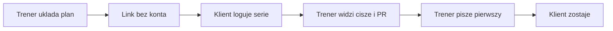

# RepMaxer — brief faktów dla rady i Deep Research

**Data:** 14 sierpnia 2026  
**Odbiorca:** rada / analityk due-diligence (GPT Deep Research)  
**Język dokumentu:** polski  
**Status:** źródło prawdy o produkcie i firmie. **Nie researchować tego pliku w internecie. Przyjąć jako dane.** Zweryfikować wolno wyłącznie twierdzenia oznaczone `[hipoteza]`.

Powiązane: [prompty Deep Research](2026-08-14-deep-research-prompty.md). Stary prompt z 30.07.2026 jest nieaktualny.

---

## Jak czytać ten dokument

Każde istotne twierdzenie ma etykietę:

| Etykieta | Znaczenie |
|---|---|
| `[fakt]` | Jest w kodzie, na landingu albo w działającym produkcie (sierpień 2026). |
| `[decyzja]` | Wewnętrzna decyzja zespołu. Research ma ją **stress-testować**, nie potwierdzać. |
| `[hipoteza]` | Desk research / blogi branżowe / specy. Może być nieprawdziwa. |
| `[nieustalone]` | Brak danych w repo. Nie zgadywać. |

Workout Alchemist to wyłącznie nazwa legacy w starych specach. Na zewnątrz produkt nazywa się **RepMaxer**. `[fakt]`

---

## 0. Decyzje, które ten pakiet ma wesprzeć

Research i rada **nie mają** przesądzać z góry „zaczynamy od Polski”. Dwie otwarte decyzje:

1. **Geografia.** Tylko Polska na start, global od dnia 1 (EN / US-UK / DACH), czy Polska + jeden rynek w 6–12 mies.? Sekcja 9.
2. **Komercjalizacja bootstrapped MVP.** Jaki cennik utrzymać, czego nie budować, które luki zabiją retencję albo sprzedaż w 90 dniach.

Wewnętrzne specy z sierpnia 2026 (GTM, Hormozi, cennik 0/39/99 zł) **zakładają PL-first**. To `[decyzja]` / dotychczasowa preferencja — nie werdykt rady.

---

## 1. Kim jesteśmy

### 1.1 Produkt

**RepMaxer** — webowy portal trenera personalnego + PWA dla podopiecznego. Obietnica na landingu: **„Wysyłasz link. Widzisz trening.”** `[fakt]`

Jedno zdanie pozycjonowania (wewnętrzne): aplikacja, dzięki której trener **reaguje pierwszy** — widzi, kto nie trenował, kto stoi w miejscu i co klient realnie zrobił — bez konta dla podopiecznego i bez ukrytych opłat. `[decyzja]`

Kontakt publiczny: `kontakt@repmaxer.pl`. `[fakt]`  
Domena produkcyjna: `[nieustalone — wpisz URL, np. app.repmaxer.pl]`.

### 1.2 Zespół i atuty dystrybucji

| Osoba | Rola | Co to daje |
|---|---|---|
| Adam | Certyfikowany trener personalny + fullstack developer | Buduje produkt i weryfikuje go na własnych podopiecznych. Iteracja bez agencji. Koszt krańcowy jednego trenera w softcie bliski zeru. `[fakt]` (rola); liczby klientów Adama: `[nieustalone]` |
| Przemek | Wspólnik, osoba ćwicząca | Druga perspektywa testowa (klient / trenujący). Nie jest „trenerem-użytkownikiem panelu” — testuje logger i portal. `[fakt]` (deklaracja zespołu) |

Dodatkowo:

- Siatka kontaktów innych trenerów personalnych — da się oddać produkt do testów bez płatnych ads. `[fakt]` (istnienie siatki); wielkość i gotowość: `[nieustalone — ile osób, ile już dostało dostęp]`
- Własni podopieczni Adama — można przypisać im plany w apce i prosić o feedback z siłowni. `[fakt]`; liczba aktywnych: `[nieustalone]`

To moat **dystrybucji i walidacji w Polsce**. Przy starcie globalnym ten moat się zeruje — research ma to policzyć, nie zignorować.

### 1.3 Model firmy

- **Bootstrap.** Bez rundy VC. `[decyzja]`
- Forma prawna, KRS, podział udziałów, runway, kapitał założycielski: `[nieustalone]`
- Koszt infrastruktury: niski (Vercel web + Azure API + Neon Postgres + Clerk + Resend + Stripe). `[fakt]` (stack); kwota miesięczna: `[nieustalone]`

### 1.4 Traction (stan na 14.08.2026)

| Metryka | Wartość |
|---|---|
| Płacący trenerzy | `[nieustalone — wpisz 0 jeśli przed Fazą A]` |
| Design partnerzy z ≥1 ukończoną sesją klienta | `[nieustalone]` |
| Własni klienci Adama na apce | `[nieustalone]` |
| MRR | `[nieustalone]` |
| Stripe / VAPID / Resend włączone na produkcji | `[nieustalone — tak/nie per klucz]` |

Produkt jest **technicznie gotowy na early access** (auth, portal, logger, radar, billing w kodzie). Brakuje publicznej trakcji i twardej walidacji WTP. `[fakt]` (gotowość kodu); trakcja = `[nieustalone]`

---

## 2. Problem, który rozwiązujemy

### 2.1 Job-to-be-done

Trener personalny układa plan siłowy, wysyła go klientowi i chce wiedzieć, **czy i jak** ten plan został wykonany — zanim klient przestanie odpowiadać na WhatsAppie i odejdzie.

Klient chce wiedzieć **co dziś robić** i **czy idzie do przodu**, bez zakładania konta i bez kolejnej apki w sklepie.

### 2.2 Czym jesteśmy / czym nie jesteśmy

**Jesteśmy** `[decyzja]`:

- Pętla coachingowa: plan → link → log serii → progres → retencja.
- Antidotum na Excel + WhatsApp przy skali ~10–25 podopiecznych.
- Antidotum na lock-in i add-ony (Trainerize-style).
- Powierzchnia klienta **dziś = PWA** (magic-link, bez konta).
- **Docelowo** natywny tracker klienta (iOS/Android) — notes siłowy jak Hevy/Strong, ale **z planem i okiem trenera**, nie samotny B2C.

**Nie jesteśmy** `[decyzja]`:

- Lepszy Hevy / Strong / Gravitus bez trenera.
- All-in-one studia (recepcja, grafiki, czytniki) jak WodGuru / Mindbody / eFitness.
- AI, które „układa treningi za Ciebie” (generation). Pitch = **consolidation**: tydzień klienta w jednej kolejce.
- Aplikacja dietetyczna. Jadłospis zostaje w PDF trenera.

Native nie oznacza pivotu w Hevy. Oznacza lepszy tracker **w tej samej pętli**.

### 2.3 ICP — dwa warianty do zbadania

**Wariant PL (dotychczasowa preferencja)** `[decyzja]`:

- Solo trener personalny / hybrydowy (stacjonarnie + online), Polska.
- 8–25 aktywnych podopiecznych.
- Dziś: Excel / Sheets + WhatsApp + ewentualnie CoachGuru / PDF.
- Boli: przepisywanie planów, brak widoku „kto trenował”, pytania „co dziś robię?”, brak narracji progresu.
- **Nie** na start: duże studia multi-trener, pure nutrition, enterprise kluby.

**Wariant globalny (alternatywa, nie target)** — research ma ocenić, czy to lepszy pierwszy rynek:

- Online / hybrid strength coach, EN (US, UK, ewentualnie DACH).
- Dziś na TrueCoach / Trainerize / Everfit / Hevy Coach albo nadal Sheets.
- Boli: rosnący TCO, 5% surcharge na płatnościach, lock-in, feature overwhelm, zły support po przejęciach.
- Wymaga UI EN, cennika USD/EUR, kanału bez polskiej siatki.

### 2.4 Pain pointy (wewnętrzna taksonomia — do weryfikacji)

Źródło: desk research lipiec–sierpień 2026. Liczby z blogów branżowych = `[hipoteza]`.

**Trenerzy**

| # | Pain | Dotkliwość | Status u nas 14.08 |
|---|---|---|---|
| T1 | Ukryte / rosnące koszty softu (add-ony, skoki tierów, % od płatności) | K | Szansa pozycjonowania; billing prosty, bez add-onów za coaching loop `[fakt]` |
| T2 | Data lock-in, migracja 8–12 h | K | Eksport JSON + CSV `[fakt]` |
| T3 | Wolne, klikaczowe programowanie | W | Composer + AI import; szablony metod bez auto-progresji z logów `[fakt]` |
| T4 | Fragmentacja (WhatsApp + Excel + osobna apka płatności) | W | Coaching w jednym miejscu; brak cash i pełnego czatu `[fakt]` |
| T5 | Brak wglądu w churn — trener dowiaduje się przy „kończę” | K | Radar + zastój + digest `[fakt]` |
| T6 | Skala >~30: ręczne check-iny = burnout | W | Check-iny + kolejka uwagi `[fakt]` |
| T7 | Słaba apka mobilna **trenera** | Ś | Responsive web; native trenera = anty-scope `[fakt]` |
| T8 | Admin: grafik, pakiety, no-show, faktury | W / biznes | Świadomie Grupa 3, nie MVP `[decyzja]` |

**Klienci trenerów (churn współpracy)**

| # | Pain | Status u nas |
|---|---|---|
| K1 | Nie widzą postępu; okno rezygnacji **tyg. 8–16** `[hipoteza]` | Trends, e1RM, Peak-End 3 fakty, share card `[fakt]` |
| K2 | Słaba komunikacja między sesjami | Komentarze sesji, notatki, e-mail, push — nie pełny czat `[fakt]` |
| K3 | Plan nie adaptuje się do życia (zajęta maszyna, podróż) | Swap ćwiczenia w loggerze `[fakt]` |
| K4 | Brak accountability między treningami | Check-iny + pomiary `[fakt]` |
| K5 | Brak planu po osiągnięciu celu | Pole „cel” tekstowe; brak lifecycle `[fakt]` |

**Adherence (porzucanie apki)**

| # | Pain | Status u nas |
|---|---|---|
| A1 | Friction logowania; **~68% „za długo / za dużo kroków”** `[hipoteza]` | Logger Gravitus-path: POPRZ., checkmark, rest, autosave `[fakt]` |
| A2 | Sztywna kolejność / brak swapu | Swap `[fakt]` |
| A3 | Utrata danych w sesji | Autosave; **zapis loggera wymaga sieci** (nie pełny offline-write) `[fakt]` |
| A4 | Karząca gamifikacja (streak reset) | Świadomie nie ma i nie dodajemy `[decyzja]` |
| A5 | Wymuszone konto przed 1. treningiem | Magic-link bez konta `[fakt]` |
| A6 | „Po co to wpisuję?” | Peak-End 3 fakty + PR + karta share `[fakt]` |

**Hipotezy liczbowe do obalenia (nie cytować jako faktów produktu):**

- 20 dni ciszy ≈ +68% ryzyka churnu. `[hipoteza]`
- Sufit WTP na soft coachingowy w PL: **39 zł / 15 osób** (kotwica CoachGuru). `[hipoteza]`
- Mediana zarobków PT PL ~8 300 zł brutto; 39 zł ≈ ¼ sesji 140–160 zł; jeden uratowany pakiet 8×150 zł = ~1 200 zł/mies. `[hipoteza]`
- Punkt przesiadki z Excela: ~10–20 klientów. `[hipoteza]`
- Okno dropoutu współpracy: tygodnie 8–16. `[hipoteza]`

---

## 3. Co mamy dziś (inwentaryzacja, sierpień 2026)

### 3.1 Architektura `[fakt]`

| Warstwa | Technologia |
|---|---|
| Frontend | Next.js 16 (App Router), React 19, Tailwind 4, port 3000 |
| Backend | .NET 10 Minimal API, EF Core, port 5210 |
| Baza lokalnie | SQLite (`EnsureCreated`) |
| Baza prod | Postgres (Neon) + migracje EF |
| Auth trenera | Clerk (JWT); lokalnie bez Clerk = seed `local-dev` |
| Auth klienta | Magic-link (`ClientAccessToken` w URL `/portal/{token}`), opcjonalny PIN 4 cyfry |
| Hosting docelowy | Vercel (web) + Azure Web App (API) + Neon |
| E-mail | Resend (wymaga klucza) |
| Push | Web Push / VAPID (wymaga kluczy) |
| Płatności | Stripe Checkout + Customer Portal + webhook (wymaga klucza) |
| AI | OpenRouter — import planu i historii |
| Multi-tenant | Light: jeden `Trainer` na konto Clerk; izolacja `TrainerId` |
| Native | **Brak.** Wizja Expo/React Native w osobnym repo, ten sam REST API |

UI w całości po polsku. Brak i18n w kodzie. `[fakt]`

### 3.2 Role

| Rola | Istnieje | Uwagi |
|---|---|---|
| Trener | Tak | Konto Clerk → encja `Trainer` |
| Klient | Tak, **bez konta** | Token w URL; PIN opcjonalny |
| Admin | Nie | Brak panelu admina |
| Studio / multi-trener | Nie | `studio` = plan cenowy 50 osób, nie organizacja |

### 3.3 Panel trenera (nawigacja)

Panel · Od klientów · Klienci · Plany · Ćwiczenia · Ustawienia. `[fakt]`

### 3.4 Portal klienta (PWA)

Zakładki: Dziś · Historia · Progres · Profil.  
Głębiej: sesja (logger), pomiary, wywiad, import historii, kalkulator %1RM, offline fallback.

- Instalowalna PWA per token (manifest, iOS splash, prompt instalacji).
- Odzyskanie linku po e-mailu: `/portal/recover`.
- **Logger wymaga sieci do zapisu.** Cache shell + strona offline ≠ offline-write serii. `[fakt]`

### 3.5 Funkcje — działa / częściowo / nie ma

**Działa w kodzie i UI** `[fakt]`:

- Kreator planów (tablica + lista, DnD, tygodnie, superserie, presety serii).
- Composer keyboard-first (składnia w stylu `3x8 rir2`).
- AI import planu (arkusz / PDF / wklejka) i AI import historii (zatwierdzenie trenera).
- Szablony metod **15-10-5** i **6-4-2-5-3-1** (logika frontowa; **bez** automatycznej progresji kilogramów z logów).
- Logger: kolumna POPRZ., checkmarki, rest timer, RIR/RPE, PR, swap, superserie, L/P, rozgrzewka, notatki serii, YouTube demo, rest lock screen.
- Biblioteka ćwiczeń (wspólna + własne) + media YouTube.
- Maxy klienta, %1RM, e1RM, trendy, objętość mięśniowa, detektor zastoju.
- Dashboard: ostatnie sesje, PR, aktywacja (aha = ukończona sesja), kolejka uwagi.
- Radar churnu: `no_plan`, `never_trained`, `silent` (≥7 dni), `low_wellness`, `no_checkin`, `low_compliance` (<50% w 14 dniach), `stagnation`.
- Check-iny (samopoczucie / sen), pomiary, zdjęcia sylwetki (blob w DB, limit).
- Wywiad (`ClientIntake`).
- Notatki trenera (prywatne, nigdy w portalu) + komentarz do sesji + odpowiedź klienta.
- Inbox „Od klientów” + centrum powiadomień.
- Eksport JSON + CSV; usuwanie konta (`DELETE /api/account`).
- Import CSV klientów.
- Onboarding 3 kroki na dashboardzie: konto → klient+link → ukończona sesja (nie osobny wizard).
- Share card PNG po sesji.
- Protokół ciszy: 3 gotowce wiadomości (nigdy nie trenował / dzień 7 / dzień 14).
- Lead magnety: `/wdrozenie`, `/checklista`, `/ile-tracisz`, `/gotowce`.
- Szkice `/regulamin` i `/prywatnosc` (wiele pól `[DO UZUPEŁNIENIA]` w samych stronach).

**Częściowo — kod jest, produkcja zależy od kluczy env** `[fakt]`:

- Stripe: subskrypcja 39/99 zł (studio 199 zł w backendzie, **brak przycisku na landingu**), founding 490 zł, Customer Portal.
- E-mail: link portalu, przypomnienia, tygodniowy digest, founding.
- Web Push + cron (`/api/cron/reminders`, `/api/cron/digest`).

**Świadomie nie ma dziś** `[fakt]`:

- Kalendarz / sloty / rezerwacje / no-show.
- Pakiety sesji i płatności **od klientów** (BLIK, Autopay).
- KSeF / faktury.
- Multi-trener jako organizacja.
- Dieta / food diary.
- Social feed, streaki-kara, leaderboard.
- Pełny czat (jest komentarz przy sesji).
- Natywna apka klienta i natywna apka trenera.
- Wearables.
- Konto klienta (upgrade z tokenu) — opcjonalny backlog.

### 3.6 Strony marketingowe `[fakt]`

`/` (Hero → produkt → preview trenera → cennik → kalkulator strat → FAQ) · `/wdrozenie` · `/checklista` · `/ile-tracisz` · `/gotowce` · `/regulamin` · `/prywatnosc` · `/sign-in` · `/sign-up`.

---

## 4. Jak to ma działać — pętla i use case’y



Poniżej scenariusze **stanu obecnego** (PWA), nie wishlisty. Ekrany = rzeczywiste route’y.

### 4.1 Trener — cold start (Faza A / onboarding)

1. Trener zakłada konto (`/sign-up`, Clerk) albo wchodzi na `/wdrozenie` i umawia 30 min (white-glove albo founding 490 zł).
2. Na dashboardzie widzi 3 kroki. Aha **nie** jest „link wysłany” — jest **ukończona sesja klienta**.
3. Tworzy plan: composer / szablon 4×3 / AI import z Excela lub PDF (`/plans/new`, `/plans/import`).
4. Dodaje 3 klientów (ręcznie albo CSV). System egzekwuje limit planu (free = 5).
5. Kopiuje magic-link albo wysyła e-mailem (`send-portal-link`). Klient **nie** zakłada konta.
6. Na callu white-glove: import 1 planu + 3 linki wysłane przy trenerze. Gate: ktoś odhacza serie w tym tygodniu.

Czas docelowy (wewnętrzny cel, nie zmierzony): pierwszy plan <10 min, pierwsza sesja klienta <7 dni. `[decyzja]` / metryka: `[nieustalone]`

### 4.2 Trener — tygodniowy rytuał

1. Otwiera Panel. Kolejka uwagi (max 10): brak planu, nigdy nie trenował, cisza ≥7 dni, niskie samopoczucie, brak check-inu, niska compliance, zastój e1RM/tonażu.
2. Klika „Napisz” — dostaje gotowiec protokołu ciszy, wysyła WhatsAppem (na razie poza apką) albo przypomnieniem w produkcie.
3. Inbox „Od klientów”: odpowiedzi przy sesjach, notatki.
4. Opcjonalnie: e-mail po sesji / PR / odpowiedzi + tygodniowy digest (gdy Resend włączony).

### 4.3 Trener — programowanie

1. `/plans` — szablon albo plan klienta.
2. Composer: `romanian 3x8-10 3010 rir2` → ćwiczenie + serie.
3. %1RM / maxy klienta, tygodnie, rampy, superserie, szablon 15-10-5 albo Poliquin 6-4-2-5-3-1.
4. Przypisanie (`Assignment` active). Klient od razu widzi dzień w portalu.
5. Po sesji: korekta kolejnego dnia (waga, RIR, zamiana ćwiczenia).

### 4.4 Trener — retencja i zaufanie

1. Profil klienta: historia, trendy, objętość mięśniowa, zastój, pomiary, zdjęcia, wywiad, maxy.
2. Peak-End: 3 fakty do pokazania klientowi (nie dashboard analityczny).
3. Ustawienia: eksport JSON/CSV, usunięcie konta, plan i Stripe (gdy klucz), opt-out maili.
4. Limit 5 → CTA „39 zł za 15”.

### 4.5 Klient dziś (PWA)

1. Dostaje link (WhatsApp / SMS / e-mail). Otwiera w Safari/Chrome. **Zero App Store, zero hasła.**
2. Opcjonalnie PIN. Opcjonalnie „Dodaj do ekranu głównego”.
3. **Dziś:** co robić na ten trening, wideo, start sesji.
4. Na siłowni: seria → kg / powt. / RIR → checkmark → timer przerwy. Kolumna POPRZ. Zajęta maszyna → **Zamień**. PR wykryty na żywo.
5. Koniec: 3 fakty (Peak-End), share card. Dane lądują u trenera.
6. Progres: trendy, e1RM, objętość. Pomiary, zdjęcia, check-in, wywiad.
7. Zgubiony link: `/portal/recover` + e-mail.

### 4.6 Klient docelowo (natywny tracker)

Ta sama pętla w apce ze sklepu (iOS + Android).

- **PWA zostaje klinem:** pierwszy trening bez tarcia sklepu.
- **Native =** jakość trackera (offline-write, ikona, push iOS, status „prawdziwa apka” — to, za co Fitebo sprzedaje branding).
- To **nie** jest osobny produkt B2C i **nie** white-label „apka trenera z logo za 200 zł/mies.”
- Wizja: Expo/React Native, osobne repo, ten sam REST API. Spec: `.ai/specs/2026-07-08-client-mobile-app.md`.
- Otwarte (nie rozstrzygnięte): auth klienta vs token, offline-first, real-time u trenera (polling vs websocket). `[nieustalone / open questions specu]`

Bramka startu native `[decyzja]`: PMF pętli na PWA (płacący trenerzy + klienci, którzy realnie logują) + odpowiedzi na Q z specu mobile.

### 4.7 Czego w use case’ach świadomie nie ma

Klient **nie** rezerwuje slotu, **nie** płaci za pakiet przez nas, **nie** dostaje jadłospisu, **nie** ma feedu społeczności. Trener **nie** wystawia faktury KSeF z apki. To Grupa 3 albo anty-scope.

---

## 5. Kolejność ficzerów

### 5.1 Zrobione (lipiec–sierpień 2026) `[fakt]`

Auth Clerk · deploy path · portal PWA · logger · radar · check-iny · swap · eksport · billing w kodzie · oferta „14 dni do pełnego wglądu” · haki GTM · Peak-End · protokół ciszy · inbox · zdjęcia · PIN.

### 5.2 Teraz — walidacja, nie feature factory `[decyzja]`

**Faza A (design partnerzy, 2–3 tyg. / 100 dni warm outreach):**

- Cel: 5–10 trenerów z **≥1 ukończoną sesją klienta** w 14 dniach. Nie signup.
- Kanał: tylko warm (znajomi, grupy FB PT PL, siłownie, DM). Zero ads.
- Oferta: 10 miejsc/mies. na call 30 min; 90 dni za 0 zł / 15 osób **albo** founding 490 zł.
- Gwarancja: jeśli w 14 dni od calla nikt nie dokończy treningu → 0 zł / zwrot. Warunek: link do ≥3 osób na callu.
- Kill: <3 partnerów z sesją / 14 dni → zmień hak lub avatar, **nie** dodawaj ficzerów.
- Powierzchnia klienta = **PWA**. Nie zaczynamy Expo.

**Faza B:** founding billing, ≥5 płacących, churn <20% w miesiącu 2.  
**Faza C:** publiczny launch + SEO „alternatywa dla…”.

Fazy A–C w specach są **PL-centric**. Przy werdykcie B (global) ten playbook trzeba przepisać — research ma to powiedzieć wprost.

### 5.3 Następne produktowe (po walidacji, nie przed) `[decyzja]`

| Priorytet | Temat |
|---|---|
| L0 | Stabilność loggera / offline / eksport / prawne — nie regresować |
| L1 | Onboarding <10 min do pierwszego planu |
| L2 | Landing + cennik spójny z werdyktem geograficznym |
| L3 | Jakość mobilnej pracy **trenera** (web) |
| L4 | Szablony metod + auto-progresja z logów |
| L5 | Peak-End / narracja jeśli luka wizualna |
| L6 | Billing live (klucze + anulowanie 1 klikiem) |
| Most do native | Offline-write loggera w PWA |

### 5.4 Docelowo — natywny tracker klienta `[decyzja]`

Expo, App Store + Google Play, ten sam API. Timing zależy też od geografii (review US vs PL, oczekiwanie „ikony w sklepie” silniejsze na EN).

### 5.5 Później — Grupa 3 (operacje PL) `[decyzja]`

Kalendarz · pakiety · płatności klientów (BLIK/Autopay) · przypomnienia · KSeF.  
To domena WodGuru. Nie blokuje Fazy A/B. Przy starcie EN można odłożyć jeszcze głębiej (BLIK/KSeF nie istnieją).

### 5.6 Anty-scope `[decyzja]`

| Nie budujemy | Dlaczego |
|---|---|
| Dieta / food diary | Najdroższy add-on konkurencji; inna domena |
| White-label App Store jako płatny add-on | Capex; PL kupuje wartość, nie logo |
| Native **trenera** przed jakością weba | Coach przy biurku / tablecie |
| Karżące streaki / social feed | Guilt → unikanie apki |
| AI-generator jako hero | Generation vs consolidation |
| All-in-one studio / czytniki | Wojna z WodGuru |
| Płatne ads przed organic proof | Continuity 39 zł nie spłaca CAC ads |
| Wieczny unlimited free | Zamknięte |

Native **klienta nie jest anty-scope** — jest celem, tylko nie teraz.

---

## 6. Jak chcemy zarabiać

Płaci **tylko trener**. Podopieczny zawsze 0 zł, bez konta. `[decyzja]` + `[fakt]` (landing, FAQ, kod limitów)

### 6.1 Cennik w kodzie i na landingu (PLN) `[fakt]` / `[decyzja]`

| Plan | Limit osób | Cena | Gdzie widać |
|---|---|---|---|
| Start / free | 5 | 0 zł na zawsze | Landing + backend |
| Solo / starter | 15 | 39 zł/mies. | Landing + Stripe checkout |
| Pro | 30 | 99 zł/mies. | Landing + Stripe checkout |
| Studio | 50 | 199 zł/mies. | **Tylko backend** — brak przycisku na landingu i w settings |
| Founding | 15 | 490 zł **raz** za 12 mies.; potem 39 zł locked forever | FAQ + `/wdrozenie`; Stripe one-time albo e-mail fallback |
| Dev | bez limitu | 0 | Lokalnie |

Limit egzekwowany przy `POST /api/clients` (`code: client_limit`). `[fakt]`

Landing **nie** pokazuje 199 zł ani 490 zł w głównej sekcji cennika — 490 zł jest w FAQ. `[fakt]`

### 6.2 Model pieniądza (fazy) `[decyzja]`

- Faza I: 10× white-glove 0 zł / 90 dni. Od 11. osoby: founding 490 zł.
- Faza II (po PMF): upsell Pro 99 zł przy progu 15.
- Faza III: continuity progowa. Anulowanie 1 klikiem (Customer Portal), gdy Stripe live.
- Stripe na founding i subskrypcję. Autopay/BLIK **dopiero** gdy >20 płatnych self-serve.
- 39 zł/mies. **nie finansuje** płatnych ads (CFA niemożliwe przy tym ARPU). Stąd warm outreach.

Research ma **obalić lub potwierdzić** progi 0/39/99/199 i 490 zł. Osobno: czy kotwica CoachGuru działa tylko na PL, a global wymaga USD/EUR i innego ARPU od dnia 1.

### 6.3 Czego nie sprzedajemy (na start)

Take-rate od płatności klientów trenera, add-on nutrition, white-label, miejsce w App Store z logo trenera. `[decyzja]`

---

## 7. Geografia — fakty vs otwarta decyzja

### 7.1 Fakty (nie researchować)

- Cały UI, landing, FAQ, lead magnety i microcopy są **po polsku**. Brak i18n. `[fakt]`
- Cennik i founding są w **PLN**. Stripe technicznie obsłuży inną walutę — nie ma oferty EN. `[fakt]`
- Playbook GTM (`.ai/gtm/`, lista trenerów, grupy FB PT) jest **PL-only**. `[fakt]`
- Siatka kontaktów i własni klienci = Polska. `[fakt]`
- Grupa 3 (BLIK, KSeF, SMSAPI) jest specyficzna dla PL i jest w backlogu, nie w MVP. `[fakt]`
- PWA nie ma geo-gate: link działa z każdego kraju. `[fakt]`
- Native później = decyzja o marketplace’ach (PL / EU / US). `[decyzja]`
- Dotychczasowa preferencja zespołu (do 12.08.2026): start PL, ekspansja DACH / UK / US / Nordics później. `[decyzja]`

### 7.2 Trzy scenariusze do porównania liczbowego

Research **nie wybiera za radę bez tabeli**. Ma policzyć A vs B vs C.

| Scenariusz | Co znaczy | Koszt foundera |
|---|---|---|
| **A. Tylko PL** (12–36 mies.) | UI PL, cennik PLN, warm outreach, walidacja na siatce | Najniższy; wykorzystuje moat dystrybucji |
| **B. Global od dnia 1** | EN (lub PL+EN) od launchu, cennik USD/EUR, ICP = online coach EN | i18n, support EN, CAC bez siatki, wojna z TrueCoach / Trainerize / Hevy Coach |
| **C. PL + jeden rynek** | PL jako baza + UK albo DACH w 6–12 mies. | Środek; wymaga kryterium „kiedy otworzyć drugi język” |

**Wymiary obowiązkowe:** TAM/SAM/SOM; ARPU; WTP; natężenie konkurencji; CAC i kanały (warm PL vs content/SEO/ads EN); czas do pierwszego przychodu przy bootstrapie; koszt i18n + supportu; ryzyko „za mały rynek PL” vs „za słabi na global”; wpływ na timing native; czy BLIK/KSeF wiąże nas z PL, czy przy starcie EN można je odłożyć.

### 7.3 Co musiałoby być prawdą, żeby odwrócić preferencję PL-first

Przykłady (research ma uzupełnić liczbami): PL TAM za mały na bootstrap 36 mies.; ARPU EN × 3–5 przy porównywalnym CAC; siatka PL nie konwertuje na sesje; i18n < X dni pracy; odwrotnie: CAC EN zjada bootstrap, a 50–100 trenerów PL wystarcza na runway.

---

## 8. Przewagi do wyceny (i zakwestionowania)

1. Founder-PT: użytkownik i dystrybutor w jednym. Może przypisać treningi swoim klientom jutro.
2. Founder-dev: iteracja w dniach, nie sprintach agencji.
3. Wspólnik-ćwiczący + siatka trenerów = tani design-partner channel **w Polsce**.
4. Trust stack vs kryzys zaufania Trainerize/ABC 2026 `[hipoteza rynkowa]`: prosta cena, eksport, klient bez konta, anulowanie bez polowania.
5. Nisza siłowa (RIR, %1RM, e1RM, composer) vs operacje studia (WodGuru).
6. Magic-link: zerowy tarcie pierwszego treningu vs „pobierz apkę z logo trenera”.
7. Estetyka mono v2 — kontrast vs enterprise fitness CRM.

Pytanie do researchu: czy to **fosa**, czy tylko tańszy start, który znika przy skali lekko większej niż 30 trenerów?

---

## 9. Luki, które już znamy

Żeby rada szukała też tych, których **nie** znamy.

| Luka | Typ |
|---|---|
| Regulamin i polityka prywatności = szkice z polami do uzupełnienia | Prawne / zaufanie |
| Stripe, push, e-mail no-op bez kluczy — „billing w kodzie” ≠ „można zapłacić na produkcji” | Operacje |
| Brak twardej trakcji płatniczej | Biznes |
| Plan Studio 199 zł w backendzie, niewidoczny w UI | Spójność oferty |
| Logger nie zapisuje w pełni offline | Jakość na siłowni; most do native |
| Brak kalendarza — rynek PL tego oczekuje; świadomy trade-off | Produkt vs sprzedaż |
| Brak multi-trenera | Sufit studia |
| Napięcie PWA vs „ikona w sklepie” (Fitebo sprzedaje status) | Pozycjonowanie |
| Hipotezy churnu z blogów, nie z naszych danych | Epistemiczne |
| i18n = zero — global od dnia 1 to nie przełączenie flagi | Geografia |
| Clerk może tarć publiczne strony marketingowe, jeśli nie są na allowliście | Techniczne |
| Brak real-time „trener widzi serię na żywo” | Wizja native / coaching |
| K5 lifecycle celów — nieobsłużone | Retencja długoterminowa |

---

## 10. Trust stack (komunikat, gdy wejdziemy w billing)

1. Podopieczni zawsze 0 zł i bez konta.
2. Dane zawsze do eksportu.
3. Bez add-onów za podstawowy coaching loop.
4. Anulowanie 1 klikiem.
5. Support founderski na early access (człowiek, nie canned).

`[decyzja]` — research ma ocenić, czy to wystarczy vs Fitebo (ikona) i CoachGuru (chat + kalendarz).

---

## 11. Pola do uzupełnienia przez zespół przed wgraniem do GPT

Wklej odpowiedzi **nad** briefem albo tu:

```
Forma prawna / nazwa spółki: …
Podział udziałów (Adam / Przemek / inni): …
Runway (mies. kosztów życia + infra): …
URL produkcji: https://repmaxer.pl/
Stripe live: tak/nie
Resend / VAPID / cron live: tak/nie
Liczba własnych klientów Adama: 6
Z tego na apce (link wysłany / sesja ukończona): …
Wielkość siatki trenerów (osób, którym możemy dać dostęp w 14 dniach): 10
Design partnerzy dziś: …
Płacący: 0
Czy Przemek ma udział formalny, czy jest wspólnikiem operacyjnym: …
```

---

## 12. Priorytety, które research ma zakwestionować

Nie potwierdzaj. Szukaj kontrprzykładów.

1. PL-first jest oczywiste, bo mamy siatkę.
2. 39 zł / 15 osób to sufit, nie podłoga.
3. Kalendarz i dieta nie są potrzebne do pierwszej sprzedaży.
4. PWA wystarczy na 12–24 mies. bez native.
5. Warm outreach wystarczy na 5–10 partnerów w 14 dniach.
6. Bootstrap bez kapitału wystarczy także przy wariancie B (global).
7. „Generation vs consolidation” — trenerzy naprawdę nie chcą AI-generatora.
8. Liczby 68% / 20 dni / okno 8–16 tyg. są prawdziwe na rynku 2026.

---

## 13. Słownik

| Termin | Znaczenie u nas |
|---|---|
| **Loguj trening** | Zapis wykonania sesji (kg, powt., czas, RIR/RPE) w loggerze — rdzeń, nie dziennik notatek |
| **Magic-link** | URL `/portal/{token}` bez konta klienta |
| **Radar / kolejka uwagi** | Lista klientów wymagających interwencji (cisza, brak planu, zastój…) |
| **Peak-End** | 3 fakty po sesji / w progresie, nie wykres za wykresem |
| **Protokół ciszy** | 3 gotowce: nigdy nie trenował / dzień 7 / dzień 14 |
| **Founding** | 490 zł raz = 12 mies. / 15 osób + 39 zł locked |
| **Grupa 3** | Kalendarz, pakiety, płatności klientów, KSeF |
| **CoachGuru / WodGuru / Fitebo** | Konkurencja PL (coaching vs operacje studia vs branding apki) |
| **TrueCoach / Trainerize / Everfit / Hevy Coach** | Konkurencja EN |
| **PWA** | Portal klienta w przeglądarce, instalowalny; obecna powierzchnia |
| **Native tracker** | Docelowa apka sklepowa klienta — nie B2C bez trenera |

---

*Koniec briefu faktów. Dalej: tylko pytania badawcze w `2026-08-14-deep-research-prompty.md`.*
