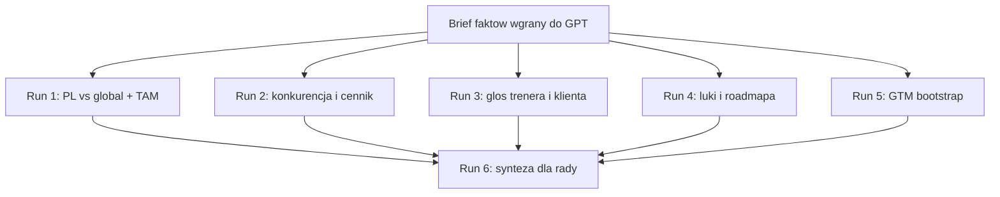

# RepMaxer — prompty Deep Research dla rady

**Data:** 14 sierpnia 2026  
**Narzędzie:** GPT Deep Research (ten sam pakiet działa w Gemini Deep Research).  
**Kontekst obowiązkowy:** wgraj / wklej najpierw [`2026-08-14-brief-rady-fakty.md`](2026-08-14-brief-rady-fakty.md). To są **dane**, nie materiał do weryfikacji w internecie — wyjątek: twierdzenia `[hipoteza]`.

Stary jednopromptowy plik z 30.07.2026 jest **nieaktualny** (nazwa Workout Alchemist, niepełna lista funkcji, przesądzony PL-first).

---

## Dlaczego 6 runów, nie jeden mega-prompt

Deep Research daje lepsze wyniki, gdy dostaje **jedną decyzję**, zakres, reguły źródeł i format — nie encyklopedię. Jeden run „zbadaj wszystko” miesza nasze hipotezy z faktami rynkowymi i słabo cytuje.

---

## Jak używać (nie pomijać)

1. Uzupełnij pola `[nieustalone]` w briefie (spółka, trakcja, klucze live) — albo wprost napisz „brak danych, przyjmij 0 płacących”.
2. Wgraj brief jako plik / wklej go **nad** promptem danego runu.
3. Włącz Deep Research. Wklej **jeden** blok „PROMPT RUN N” (od linii `---` do `KONIEC PROMPTU`).
4. **Zanim research ruszy, edytuj plan:** dopnij geografię, wytnij zbędne wątki, zamień miękkie czasowniki na twarde („porównaj cennik, TCO, take-rate, add-ony” zamiast „omów konkurencję”).
5. Raport = draft. Sprawdź ręcznie **5 cytowań** (otwórz URL: czy źródło naprawdę wspiera zdanie).
6. Dopytaj o sekcje cienkie / `[niepewne]`.
7. Na koniec runu: *„Czego ten raport unika? Na co wskazałby sceptyczny partner funduszu?”*
8. Po runach 1–5 wgraj **wszystkie pięć raportów** + brief i odpal Run 6 (synteza, bez nowych searchy jeśli tool na to pozwala; jeśli nie — dozwolone tylko uzupełnienie braków oznaczonych „nie znaleziono”).

**Język raportów:** polski. Źródła przeszukuj po **polsku i angielsku**.

**Recency:** źródła publikowane lub aktualizowane po styczniu 2024; liczby rynkowe preferuj z ostatnich 12 miesięcy. Przy każdej liczbie: data źródła.

**Rygor (wszystkie runy):**

- Priorytet: cenniki ze stron firm, GUS/rejestry, IHRSA/IHSA, G2/Capterra, Crunchbase, recenzje Trustpilot, wątki Reddit/fora jako głos (oznacz **anegdotyczne**), raporty z ostrożnością (Grand View itd. często recykling).
- Unikaj: listicle „top 10 apps”, SEO bez danych pierwotnych, raportów sprzed 2024.
- Każda liczba: źródło + data. Brak danych = **„nie znaleziono”**, nie szacunek ukryty jako fakt.
- Każde istotne twierdzenie: **[potwierdzone]** (2+ niezależne źródła) / **[sporne]** (pokaż rozbieżność) / **[niepewne]** (1 słabe źródło).
- Nie researchuj stacku, encji ani tego, „czy produkt naprawdę ma logger” — to jest w briefie.
- Nie przyjmuj PL-first, 39 zł sufitu, 68%, 20 dni ciszy ani okna 8–16 tyg. jako faktów.

**Wspólny format wyjścia (runy 1–5):**

1. Executive summary — max 300 słów: werdykt + 3 liczby + co dalej.
2. Sekcje = sub-pytania z promptu; max ~600 słów na sekcję; tabele tam, gdzie porównanie.
3. Tabela założeń: założenie → wartość → źródło albo „szacunek własny” → wpływ na wynik.
4. Sekcja niepewności: czego nie ustalono + jak zbadać taniej (np. 10 rozmów z trenerami).
5. Bibliografia: link + data + typ (raport / cennik / forum / blog).

Zanim zaczniesz search: wypisz plan (sub-pytania, typy źródeł, 3 rzeczy które unieważnią wnioski) i **poczekaj na akceptację**.

---

## PROMPT RUN 1 — PL vs global + TAM

---

Działaj jako senior analityk rynku SaaS i strateg na poziomie due-diligence funduszu — sceptyczny, liczbowy, bez marketingowego optymizmu. Odbiorca: **rada** bootstrapped produktu RepMaxer (brief wgrany — przyjmij jako dane; nie weryfikuj stacku ani listy funkcji w internecie). Raport po polsku; źródła PL + EN.

### Decyzja

**Główna decyzja geograficzna:** czy komercjalizować RepMaxer jako (A) tylko Polska przez 12–36 miesięcy, (B) global od dnia 1 (EN, US-UK i/lub DACH), czy (C) Polska + jeden rynek w 6–12 mies.? Nie przyjmuj PL-first z briefu. To hipoteza zespołu do obalenia.

### Zakres

- Geografia do policzenia **osobno**: Polska, DACH, UK, USA, Nordics. Inne rynki tylko jeśli zmieniają werdykt.
- Segment: solo / małe praktyki trenerów personalnych i online strength coaches. Wyklucz: sieci siłowni enterprise, czysty B2C tracker jako TAM (Hevy/Strong wolno użyć jako **zagrożenie** i benchmark oczekiwań klienta).
- Horyzont: 12 / 24 / 36 miesięcy, bootstrap (brak rundy VC, mały zespół, UI dziś tylko PL, siatka dystrybucji tylko PL — to ograniczenia z briefu, nie wnioski).

### Sub-pytania (jedna sekcja = jedno pytanie)

1. Ilu jest aktywnych trenerów personalnych / online coaches w PL, DACH, UK, US, Nordics? Jaki odsetek prowadzi coaching z programowaniem (nie tylko sesje na siłowni)? Jaki odsetek płaci za jakikolwiek soft trenerski? Porównaj min. 2 źródła na rynek.
2. TAM / SAM / SOM z jawnym łańcuchem założeń **per rynek**. TAM = liczba płatników × 12 × realny ARPU rynkowy. SAM = TAM × % w niszy siłowej/hybrydowej × % skłonnych płacić. SOM 36 mies. dla bootstrapped foundera — uzasadnij benchmarkiem (ile klientów zdobyły WodGuru / CoachGuru / Hevy Coach / TrueCoach we wczesnych latach, jeśli dane są). 3 scenariusze (pesymistyczny / bazowy / optymistyczny) + wrażliwość na adopcję i ARPU.
3. Tabela **A vs B vs C** (definicje w briefie §7.2): realistyczny przychód 12/24/36 mies. przy bootstrapie; CAC; czas do 5 płacących; koszt i18n + supportu EN; czy moat siatki PL ginie w B. Każda komórka: liczba albo „nie znaleziono”.
4. Ryzyko „PL za mały na bootstrap 36 mies.” vs „za słabi na global od dnia 1”. Co musiałoby być prawdą, żeby odwrócić werdykt (warunki odwrócenia).
5. Wpływ geografii na timing **natywnego trackera** (App Store US vs PL; oczekiwanie ikony vs PWA) i na Grupę 3 (BLIK/KSeF — kotwica PL czy zbędna przy EN).
6. Werdykt: A, B albo C + 5 zdań uzasadnienia + kill criteria na 90 dni.

### Czego nie robić

Nie researchować naszego stacku. Nie zakładać, że 39 zł to globalny sufit. Nie mieszać TAM PL z TAM „fitness apps”.

Zatrzymaj się na planie i poczekaj na akceptację.

KONIEC PROMPTU

---

## PROMPT RUN 2 — konkurencja i cennik

---

Działaj jako senior analityk SaaS (due-diligence). Odbiorca: rada RepMaxer. Brief wgrany = dane o naszym cenniku i produkcie; **nie wymyślaj naszego cennika od zera — stress-testuj go**. Raport po polsku; źródła PL + EN.

### Decyzja

Czy progi **0 zł / 5, 39 zł / 15, 99 zł / 30, 199 zł / 50** i founding **490 zł** są obronne **na rynku PL**? Jaki cennik byłby obronny **globalnie** (USD/EUR)? Dwie kolumny: PL vs EN — nie jeden „średni świat”.

### Zakres

Gracze obowiązkowi (sprawdź aktualne strony cennika, nie agregatory z 2023):

- PL: CoachGuru, WodGuru, Fitebo, CoachPro, Trainomi, Sportpilot, inne jeśli materialne.
- EN: TrueCoach, ABC Trainerize, Everfit, Hevy Coach, CoachRx, FitBudd; B2C Hevy/Strong tylko jako kotwica oczekiwań klienta i free-tier threat.

Kotwice z naszego desk researchu (sierpień 2026) — **zweryfikuj, nie przyjmuj**: TrueCoach 5% surcharge na płatnościach; Trainerize add-ony (nutrition itd.); CoachGuru 0 / 39 / 119 / 249; WodGuru 5 zł/klient, cap ~499 zł; TCO przy 25–30 klientach często 125–200 USD/mies. z add-onami.

### Sub-pytania

1. Tabela cenników: model (flat / próg / per-klient / % take-rate), entry, free tier, add-ony, opłata od płatności, white-label, kto płaci (trener vs klient). Data sprawdzenia = data Twojego odczytu strony.
2. TCO przy 5 / 15 / 30 / 50 aktywnych podopiecznych — PL osobno, EN osobno.
3. Kto zarabia najwięcej i na czym (subskrypcja vs take-rate vs add-ony vs studio)? Finansowanie / przejęcia (ABC + Trainerize) i implikacja zaufania.
4. Stress-test naszych progów vs CoachGuru (PL) i vs TrueCoach/Everfit (EN). Gdzie jesteśmy drodzy, gdzie tani, gdzie „inny produkt”. Czy 490 zł founding jest czytelne, czy za wysokie na PL / za niskie na EN.
5. Rekomendacja: (a) zostawić 0/39/99/199, (b) zmienić konkretne progi, (c) inny model (per-klient, USD lista + PL wyjątek). 2–3 opcje z plusami/minusami. Nie zakładaj, że kotwica CoachGuru działa poza PL.
6. Czy brak kalendarza / diety / native / czatu **uniemożliwia** naszą cenę, czy tylko obniża conversion o X (oszacuj tylko z dowodów; inaczej „nie znaleziono”).

### Czego nie robić

Nie pisz „jesteście lepsi”. Nie uśredniaj USD i PLN w jedną kolumnę bez kursu i daty.

Zatrzymaj się na planie i poczekaj na akceptację.

KONIEC PROMPTU

---

## PROMPT RUN 3 — głos trenera i klienta

---

Działaj jako researcher insightów (jakość McKinsey qualitative + sceptycyzm). Odbiorca: rada RepMaxer. Brief zawiera naszą taksonomię T1–T8, K1–K5, A1–A6 i use case’y — **zweryfikuj, czy żyją w 2026**. Raport po polsku; źródła PL + EN.

### Decyzja

Które pain pointy i use case’y z briefu są **must-have do pierwszej sprzedaży**, które wish, które obalone? Nie przyjmuj liczb 68%, 20 dni ciszy, okna 8–16 tyg.

### Zakres

- Głos trenerów: Reddit r/personaltraining, r/onlinecoaching; grupy / fora PL (FB PT, jeśli indeksowane); G2/Capterra/Trustpilot najniższe oceny TrueCoach, Trainerize, Everfit, CoachGuru, Fitebo, WodGuru.
- Głos trenujących: recenzje Hevy, Strong, Gravitus, Boostcamp, Styrka; wątki o rezygnacji ze współpracy z PT.
- Osobno PL i EN, jeśli wzorce się różnią (np. PL = kalendarz/BLIK, EN = lock-in/add-ony).

### Sub-pytania

1. Tabela T1–T8: potwierdzasz / obalasz / brakuje nam na liście. Cytaty-wzorcę (anegdotyczne) + powtarzalność.
2. Tabela K1–K5 i A1–A6 analogicznie. Co naprawdę psuje adherence loggera w 2026 (superserie, offline, konto, gamifikacja)?
3. Use case’y z briefu §4 (cold start, rytuał tygodnia, programowanie, PWA na siłowni, native docelowo): które są must, które trenerzy deklarują a nie płacą (ujawniona preferencja vs ankieta).
4. Generation vs consolidation: czy w 2025–2026 trenerzy faktycznie odrzucają AI „układa za Ciebie”, a chcą kolejkę tygodnia? Dowody za i przeciw.
5. PWA vs „ikona w sklepie”: jak często brak native zabija deal u solo PT (PL vs EN vs Fitebo-style branding)?
6. Lista 5 pytań, których internet nie rozstrzygnie — do 10 rozmów walidacyjnych (skrypt).

### Czego nie robić

Nie przyjmuj naszych hipotez liczbowych. Nie traktuj landingów konkurencji jako głosu użytkownika (to deklaracja sprzedawcy).

Zatrzymaj się na planie i poczekaj na akceptację.

KONIEC PROMPTU

---

## PROMPT RUN 4 — luki produktu i roadmapa

---

Działaj jako product strategist due-diligence. Odbiorca: rada RepMaxer. Brief = stan produktu (co jest / czego nie ma / PWA teraz / native docelowo). Nie proponuj diety, kalendarza ani natychmiastowego Expo **bez money-case**. Raport po polsku.

### Decyzja

Co zabiłoby sprzedaż lub retencję w **90 dniach**? Co można odłożyć? Kiedy PWA przestaje wystarczać i jaki jest koszt/timing native trackera vs Fitebo / Hevy?

### Zakres

Gap vs konkurencja z Run 2 (jeśli niedostępny: zrób skrót z publicznych stron) i vs oczekiwania ICP z briefu. Dwa wiersze: ICP PL i ICP EN.

### Sub-pytania

1. Macierz: potrzeba rynku × status RepMaxer (OK / częściowo / brak / anty-scope). Osobno PL i EN.
2. Top 5 luk, które **blokują pierwszą płatność** vs top 5, które bolą dopiero przy 30+ klientach.
3. Kalendarz / pakiety / BLIK (Grupa 3): na PL — must do Fazy B czy po PMF? Na EN — zbędne?
4. Native tracker: koszt (czas, review, push iOS, offline-write, dwa sklepy), timing benchmarków (kiedy Hevy/Fitebo/TrueCoach uznali native za higienę), warunek bramki z briefu (PMF na PWA) — potwierdź lub obal. Wpływ geografii (start US bez ikony vs start PL).
5. Roadmapa 90 / 180 / 365 dni **dla wariantu A i osobno dla B** (nie jedna lista). Każdy item: po co (pieniądze albo retencja), nie „fajnie mieć”.
6. Anty-scope z briefu: które z tych „nie budujemy” jest w 2026 realnym deal-breakerem wg recenzji (nie wg landingów)?

### Czego nie robić

Nie pisz backlogu UI. Nie rekomenduj feature factory przed design partnerami. Nie zakładaj, że native = pivot w B2C tracker.

Zatrzymaj się na planie i poczekaj na akceptację.

KONIEC PROMPTU

---

## PROMPT RUN 5 — GTM bootstrap

---

Działaj jako operator GTM (early-stage B2B SaaS, nie brand agency). Odbiorca: rada RepMaxer. Brief: bootstrap, warm outreach 100 dni, siatka PL, ARPU 0–99 zł, ads świadomie wyłączone. **Nie zakładaj z góry tylko PL** — rozdziel kanały dla A, B i C z Run 1. Raport po polsku.

### Decyzja

Czy warm outreach + siatka trenerów wystarczy na wariant A? Czym zastąpić ją w wariancie B? Czy brać kapitał zewnętrzny, jeśli B wymaga innego CAC? Nie pisz brand booka.

### Zakres

Horyzont 90 dni i 12 miesięcy. Solo / duo founder. Continuity ~39 zł/mies. (PL) albo odpowiednik EN z Run 2.

### Sub-pytania

1. Benchmarki CAC i payback dla vertical SaaS mikroprzedsiębiorców / creator tools / PT software (2024–2026). Przy 39 zł/mies. jaki CAC jest zabójczy? Przy typowym ARPU EN — analogicznie.
2. Wariant A: czy 20 spersonalizowanych wiadomości dziennie + haki (`/checklista`, `/ile-tracisz`, `/gotowce`) + 10 calli white-glove to wiarygodna ścieżka do 5–10 partnerów z sesją w 14 dniach? Analogie (concierge MVP, paid pilots). Kill signals.
3. Wariant B: kanały bez polskiej siatki (SEO „TrueCoach alternative”, communities Reddit/Facebook EN, Product Hunt, directories, affiliates). Szacunkowy czas do 5 płacących vs A. Czy founding 490 zł / analog USD trzyma.
4. Wariant C: kryterium „kiedy otworzyć drugi język” (metryki, nie data w kalendarzu).
5. Kapitał: przy jakich założeniach bootstrap umiera (szczególnie B)? Jaka najmniejsza runda miałaby sens — i czego **nie** finansować (ads przed message-market fit, native przed PMF).
6. Oferta „14 dni do pełnego wglądu” + gwarancja warunkowa: czy to standard, który zwiększa konwersję, czy red flag na tym rynku? Porównaj trial 14–30 dni konkurencji.
7. Rekomendacja 90 dni: jeden kanał, jedna oferta, jedna metryka gate — **osobno dla A i dla B**.

### Czego nie robić

Nie mieszaj GTM PL i EN w jedną radę bez rozdzielenia. Nie rekomenduj Meta ads jako pierwszego ruchu bez matematyki CAC < 1 mies. ARPU.

Zatrzymaj się na planie i poczekaj na akceptację.

KONIEC PROMPTU

---

## PROMPT RUN 6 — synteza dla rady

---

Działaj jako partner funduszu piszący **jedno memo dla rady**. Masz: brief faktów RepMaxer + raporty z runów 1–5. **Nie prowadź nowych searchy**, chyba że raport oznacza „nie znaleziono” przy liczbie, bez której nie da się wydać werdyktu — wtedy tylko te luki.

Odbiorca: rada. Ton: suchy, źródłowy, bez pitchu. Język: polski.

### Decyzja

Wydać werdykt i plan 90 dni. Najpierw geografia, potem reszta.

### Format (sztywny)

1. **Werdykt geograficzny (A / B / C)** — 1 akapit + warunki odwrócenia (3 bullet).
2. **Trzy liczby, które zmieniają decyzję** — każda ze źródłem z runów i etykietą [potwierdzone] / [sporne] / [niepewne].
3. **Cennik:** zostawić / zmienić (PL i EN osobno, nawet jeśli wybieracie A).
4. **Pięć luk** uszeregowanych: zabije sprzedaż w 90 dniach → można odłożyć. Native i kalendarz muszą dostać zdanie „teraz / nie teraz / pod jakim warunkiem”.
5. **Rekomendacja 90 dni** — max 8 bulletów operacyjnych (kanał, oferta, metryka gate, czego nie kodować).
6. **Kill criteria** — 3 sygnały, przy których przestajemy pchać ten wektor (nie „pivot w dietę”).
7. **Czego raporty 1–5 nie rozstrzygnęły** — lista do 10 rozmów z trenerami / własnymi klientami (imiona ról, nie imiona ludzi).
8. **Załącznik:** 1 tabela A vs B vs C (przychód 12/36, CAC, czas do 5 płacących, ryzyko).

Max 1 200 słów bez załącznika. Żadnych nowych ficzerów spoza briefu i runów.

KONIEC PROMPTU

---

## Po syntezie — 10 rozmów (nie internet)

Nawet dobry Deep Research nie zastąpi karty. Z playbooka GTM, po Run 6:

Na każdych z pierwszych 10 rozmów z trenerami zapisz:

1. Czym dziś wysyłasz plan? (Excel / WhatsApp / już płacący soft)
2. Ile za to płacisz?
3. Ile osób skończyło współpracę w roku + stawka (ich liczba do `/ile-tracisz`, nie 1 200 zł z bloga)

Avatar OK: 8/10 na Excelu + WhatsAppie (albo PDF).  
Zły wektor: 8/10 chce dietę i kalendarz **zanim** wyślą link — zmień hak, nie roadmapę.

Jeśli werdykt = B, te same 3 pytania po angielsku + „czego nienawidzisz w TrueCoach/Trainerize”.

---

## Checklista jakości raportu (dla Ciebie, nie dla modelu)

- [ ] Plan zedytowany przed startem każdego runu
- [ ] 5 losowych cytowań otwartych w przeglądarce
- [ ] Każda liczba ma datę
- [ ] Hipotezy 68% / 20 dni / 8–16 tyg. oznaczone, nie wklejone do decku rady jako fakty
- [ ] Geografia: A vs B vs C w tabeli, nie w eseju
- [ ] Pytanie końcowe: „czego ten raport unika?”
- [ ] Run 6 dopiero po 1–5
