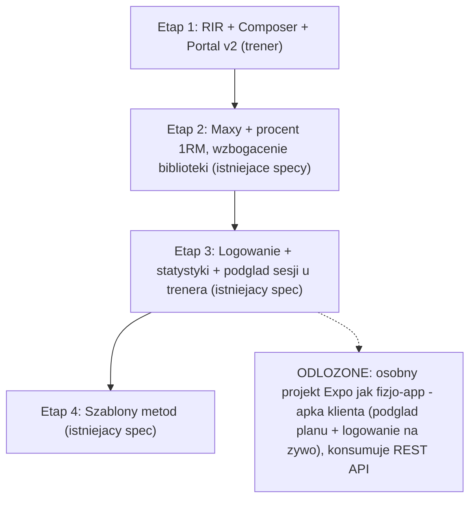

# Roadmap: od planu do treningu

## TLDR

Master roadmap spec-driven, który doprowadza portal trenera do stanu opisanego w makietach `htmls from design/` (kreator „szybkie wpisywanie", RIR, redesign v2 po audycie kosztu interakcji), sekwencjonując go razem z czterema już istniejącymi, oczekującymi specami (`client-maxes-percent-loading`, `workout-logging-stats`, `method-templates`, `exercise-library-enrichment`). Aplikacja mobilna klienta (podgląd planu + logowanie na żywo) jest świadomie **odłożona** — powstanie jako osobny projekt Expo/React Native, wzorem `../fizjo-app`, poza tym repo.

## Problem

Makiety (`htmls from design/Proces - od planu do treningu.html`, `Kreator planu - szybkie wpisywanie (standalone).html`, `Kreator planu - makiety.html`, `Trainer Portal - widoki v2.html`) opisują pełny przepływ end-to-end: trener buduje plan klawiaturą → przypisuje klientowi → klient widzi plan i dzień w apce → klient trenuje i loguje serie na żywo → trener widzi wynik i koryguje kolejny dzień. Dziś:

- kreator planu (`apps/web/components/plan-builder/`) jest myszowy — brak keyboard-first composera z makiet („romanian" → podpowiedź → `↵` dodaje),
- model planu ma `TargetRpe`, ale makiety konsekwentnie używają **RIR** („RIR 2", „RIR celu: 1"),
- portal trenera (dashboard, klienci) nie przeszedł audytu kosztu interakcji z makiet v2 (liczniki w nawigacji, kolejka „wymaga uwagi", smart defaults, Undo),
- nie istnieje żadna warstwa wykonania treningu (logowanie faktycznych serii) — jest tylko **spec** (`workout-logging-stats`), niezaimplementowany,
- nie istnieje żaden surface dla klienta (mobile) — kroki 3–6 z „Proces…" nie mają dziś odpowiednika w kodzie.

Bez planu-indeksu istnieje ryzyko, że nowe funkcje z makiet zostaną zaimplementowane bez uwzględnienia zależności z już zaplanowanymi specami (np. RIR wpływający na model przed logowaniem, albo apka klienta budowana przed ustaleniem kontraktu API).

## Proponowane rozwiązanie

Jeden **spec-indeks** (ten dokument) + osobne specy per funkcja, zgodnie z `.ai/specs/AGENTS.md`. Sekwencja etapów dependency-driven: najpierw zmiany o niskim ryzyku i wysokiej wartości UX dla trenera (Etap 1), potem dane wejściowe do procentowego ładowania (Etap 2), potem warstwa wykonania (Etap 3), potem generator szablonów metod, który zależy od obu poprzednich (Etap 4). Aplikacja klienta jest odłożona jako osobny projekt — w tym repo zostaje po niej tylko spec-wizja z otwartymi pytaniami.

Zakres tego repo = **portal trenera** (Next.js 16 + .NET 10 Minimal API). Aplikacja mobilna klienta to **osobny projekt Expo/React Native**, wzorowany na `../fizjo-app` (Expo Router, auth Clerk, buildy/submit przez EAS na App Store i Google Play), konsumujący REST API tego repo.

## Stan obecny

- **Backend** (`apps/api`): `Plan → PlanDay → PlanItem → PlanSet` + `Assignment`. Superserie (`SupersetGroup`), tempo, rampy, `%` (`PercentOf: "1rm"|"top"`), tygodnie (`WeekNumber`) — zaimplementowane. Brak: RIR (tylko `TargetRpe`), logowania wykonania, endpointów dla klienta.
- **Frontend** (`apps/web`): kreator (widok Tablica + Arkusz, drag&drop, `SetSchemeEditor`), CRUD klientów/ćwiczeń, przypisania planu klientowi. Brak composera „szybkie wpisywanie", brak logowania, brak jakiegokolwiek surface'u dla klienta.
- **Istniejące oczekujące specy** (`.ai/specs/`, wszystkie z 2026-07-05): `client-maxes-percent-loading.md`, `workout-logging-stats.md`, `method-templates.md`, `exercise-library-enrichment.md`. Jeden wdrożony: `implemented/plan-creator-structure.md`.

## Sekwencja etapów

| Etap | Specy | Status | Zależy od |
|---|---|---|---|
| 1 | `2026-07-08-rir-support.md`, `2026-07-08-quick-entry-composer.md`, `2026-07-08-trainer-portal-v2-friction-audit.md` | nowe, pełne | — |
| 2 | `2026-07-05-client-maxes-percent-loading.md`, `2026-07-05-exercise-library-enrichment.md` | istniejące, oczekujące | Etap 1 (reset `trainer.db` w jednej turze) |
| 3 | `2026-07-05-workout-logging-stats.md` | istniejące, oczekujące | Etap 2 (maxy przydatne do PR-ów) |
| 4 | `2026-07-05-method-templates.md` | istniejące, oczekujące | Etap 2 (maxy) + Etap 3 (logi) |
| odłożone | `2026-07-08-client-mobile-app.md` | szkielet-wizja, Open Questions | Etap 3 (kontrakt danych wykonania) |

Uwaga: Etapy 2–4 to już istniejące specy — ten roadmap ich nie duplikuje, tylko ustala kolejność i punkt wejścia. Każdy z nich przed implementacją przechodzi jeszcze przez własną fazę „Rozwinięcie" (TEMPLATE.md), bo dziś nie mają Open Questions do rozstrzygnięcia.

## Etap 1 — zakres szczegółowy

1. **`rir-support`** — `PlanItem`/`PlanSet` dostają `TargetRir`; UI kreatora i podglądu przechodzi z RPE na RIR jako główną jednostkę intensywności planu.
2. **`quick-entry-composer`** — inline, keyboard-first pole dodawania ćwiczeń w kolumnie/wierszu dnia (`"romanian 3x8-10 3010 rir2"` → `↵`), zero zmian kontraktu API.
3. **`trainer-portal-v2-friction-audit`** — redesign dashboardu, listy klientów i karty klienta wg audytu z makiety v2: liczniki w nawigacji, kolejka „wymaga uwagi", smart defaults, destrukcyjne akcje + Undo.

Kolejność wewnątrz etapu: **RIR najpierw** (zmiana schematu, jeden reset `trainer.db`), potem composer i portal v2 równolegle (nie dotykają schematu).

## Poza zakresem (świadomie odłożone)

- **Aplikacja mobilna klienta** — kroki 3–6 z „Proces — od planu do treningu" (podgląd planu, podgląd dnia, trening i logowanie na żywo) oraz część kroku 7 („na żywo" po stronie trenera). Trafi do **osobnego repo/projektu Expo/React Native**, wzorem `../fizjo-app`. W tym repo zostaje tylko `2026-07-08-client-mobile-app.md` — szkielet z Open Questions (auth, kontrakt API dla klienta, real-time, offline) — nie rozpisujemy dalej, dopóki te pytania nie są odpowiedziane.
- **Automatyczna progresja między tygodniami** (np. 15-10-5: +2,5 kg po sukcesie) — zależy od Etapu 3 (logi) i jest częścią `method-templates.md` (Faza 4–5 tego specu), nie tego roadmapu.

## Ryzyka i wpływ

- **Reset `trainer.db` w Etapie 1a (RIR)** — utrata danych lokalnych/demo; mitygacja: seed odtwarza dane, operacja jednorazowa i zapowiedziana z góry.
- **Rozjazd RPE/RIR w okresie przejściowym** — jeśli `workout-logging-stats` (Etap 3) zostanie wdrożony z `Rpe` na `LoggedSet` zanim RIR w planach się ustabilizuje, powstaną dwie jednostki intensywności w systemie. Mitygacja: `rir-support` (Etap 1) definiuje jawnie relację `RIR = 10 − RPE` i to on jest wdrażany pierwszy — logowanie (Etap 3) dziedziczy tę konwencję.
- **Apka klienta budowana bez ustalonego kontraktu API** — ryzyko przepisywania endpointów po fakcie. Mitygacja: `client-mobile-app.md` zostaje w fazie Open Questions (bramka), nie startujemy budowy Expo, dopóki kontrakt (auth, scoped endpoints) nie jest rozstrzygnięty w tym repo.
- **Kolejność Etap 2 vs Etap 1** — jeśli ktoś zaimplementuje Etap 2 przed Etapem 1, RIR trzeba będzie dodać w drugim resecie bazy. Mitygacja: ten dokument jest jedynym źródłem prawdy o kolejności — sprawdzić przed startem nietrywialnej zmiany (zgodnie z `AGENTS.md`).

## Changelog

- 2026-07-08 — utworzono roadmap; zsekwencjonowano 4 istniejące oczekujące specy z 3 nowymi (RIR, quick-entry composer, portal v2) i wydzielono aplikację mobilną klienta jako odłożony, osobny projekt (wzorem `fizjo-app`) opisany szkieletem `client-mobile-app.md`.
