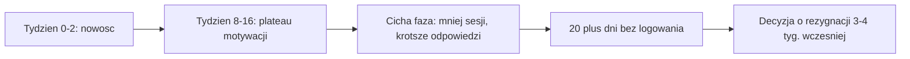
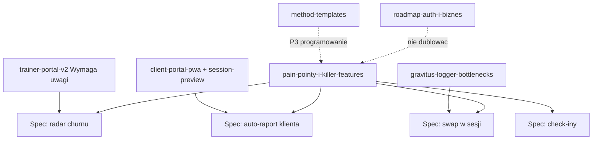

# Pain pointy trenerów i klientów + killer features

## TLDR

Dokument researchowy (bez implementacji) — źródło prawdy pod roadmapę produktową: co boli trenerów personalnych i ich klientów, co już rozwiązujemy, a gdzie leży największa wartość (killer features).

**Główne wnioski:**

1. **„Loguj trening"** = zapis wykonania sesji (kg / powtórzenia / czas / RIR / RPE) w loggerze — to rdzeń produktu, nie osobna funkcja „dla trenera". Friction tu = brak danych = brak retencji.
2. Trenerzy najgłośniej narzekają na **ceny/ukryte opłaty**, **data lock-in**, **wolne programowanie** i **fragmentację** (WhatsApp + Excel + osobna apka płatności).
3. Klienci rezygnują głównie przez **brak widocznego progresu** (okno 8–16 tygodni) i **tarcie logowania** (68% porzuceń logowania = „za długo / za dużo kroków"). Reguła: **20 dni ciszy ≈ +68% ryzyka churnu**.
4. Nasze atuty vs rynek: magic-link **bez konta**, PWA + offline, composer „3x8 rir2", Gravitus-owy logger, maxy/%1RM, zalążek „Wymaga uwagi".
5. Największa niewykorzystana wartość (kolejność rekomendowana): **radar churnu** → **auto-raport postępów dla klienta** → **podmiana ćwiczenia w sesji** → check-iny między sesjami → komunikacja in-app (MVP notatki) → eksport danych.
6. Świadomie **nie** budujemy: karzącej gamifikacji (streaki-kara), social feedu, feature-bloated all-in-one na start.
7. Biznes (kalendarz / pakiety / płatności) = osobna ścieżka w [`2026-07-30-roadmap-auth-i-biznes.md`](2026-07-30-roadmap-auth-i-biznes.md) — tu skupiamy się na coaching loop (program → log → progres → retencja).

> Nie kodować z tego pliku. Każdy killer feature dostanie własny spec implementacyjny po rozstrzygnięciu Open Questions.

## Open Questions (bramka przed kolejnymi specami)

- Q1: Które 2–3 killer features wchodzą do najbliższego cyklu (MVP retencji)?
- Q2: Radar churnu — tylko sygnały z sesji (dni bez treningu / spadek compliance), czy od razu też check-iny?
- Q3: Auto-raport — push do klienta (email / PWA notification) czy tylko widok w portalu „Twój miesiąc"?
- Q4: Komunikacja — notatki przy sesji wystarczą na MVP, czy wątek chat-like per klient?
- Q5: Eksport danych — priorytet marketingowy (anti lock-in) czy odłożyć do post-auth?

---

## Metodologia i źródła

Research deskowy (lipiec 2026), trzy warstwy:

| Warstwa | Źródła |
|---|---|
| Soft coaching (EN) | Porównania/recenzje Trainerize, TrueCoach, Everfit 2026; ukryte opłaty; Capterra/G2 cytowane w przeglądach |
| Głos trenerów | Agregaty Reddit (`r/personaltraining`, wątki „every PT software sucks"); Mindbody / gym software Reddit 2026 |
| Retencja klientów | Trainerize blog (churn), Inara / Gymkee / FitEcho (powody rezygnacji, early warning), badania porzuceń fitness apps |
| Rynek PL | CoachPro, Fitebo, CoachGuru, Sportpilot, Trainomi — pozycjonowanie i obietnice (kalendarz, komunikacja, raporty, white-label) |
| Stan produktu | Analiza kodu Workout Alchemist (portal, `SessionLogger`, maxy, dashboard) + istniejące specy w `.ai/specs/` |

**Uwaga metodologiczna:** część liczb (np. „68% przestaje logować przez friction", „20 dni ciszy → +68% churn") pochodzi z blogów produktowych branży coaching — traktujemy je jako **kierunkowe**, nie jako peer-reviewed. Wystarczają do priorytetyzacji product sense; przed budową metryk w produkcie zweryfikujemy własnymi danymi.

### Co znaczy „Loguj trening" w naszej aplikacji

Przycisk na karcie klienta bierze aktywne przypisanie planu, wybiera **następny niezrobiony dzień** i tworzy `WorkoutSession` (`POST /api/sessions/start`). Otwiera wspólny `SessionLogger` (trener lub portal klienta): per seria wpisujesz kg / powtórzenia / czas / dystans / RIR·RPE, odznaczasz serie, kopiujesz poprzednie wartości, masz timer przerwy i wykrywanie PR. Auto-zapis → `PUT /api/sessions/{id}`; „Zakończ" → complete. Dane zasilają historię, rekordy i maxy. To **wykonanie planu**, nie osobny „dziennik notatek".

---

## Pain pointy trenerów

Skala dotkliwości: **K** = krytyczna (pieniądze / odejście z platformy), **W** = wysoka (codzienne tarcie), **Ś** = średnia (bolesne przy skali).

| # | Pain point | Dowód / kontekst | Dotkliwość | Dotyczy nas? |
|---|---|---|---|---|
| T1 | **Ukryte i rosnące koszty softu** — add-ony nutrition $20–45/mies., skoki tierów przy liczbie klientów, do 5% surcharge na płatnościach (TrueCoach), white-label setki $/mies. | AssistantCoach „Hidden Fees" 2026; Trainerize vs TrueCoach reviews | K | Nie dziś (brak SaaS billing) — **szansa pozycjonowania**: prosta, przewidywalna cena gdy wejdziemy w Grupę 3 |
| T2 | **Data lock-in** — eksport CSV kontaktów bez historii check-inów, zdjęć, szablonów; migracja 8–12 h+ ręcznego przepisywania | TrainerVerdict migration; Reddit „migration migraine" (Mindbody) | K | **Brak** eksportu — luka i wyróżnik do zbudowania |
| T3 | **Wolne / klikaczowe programowanie** — proste zmiany = za dużo kroków; kreatory restrictive | Reddit / 1fit.com agregat 2026; nasze własne friction audit | W | **Częściowo rozwiązane** (composer, inline create, RIR); nadal miejsce na szablony metod |
| T4 | **Fragmentacja narzędzi** — plany tu, WhatsApp tam, płatności gdzie indziej; info ginie | Reddit coaches; CoachPro/Fitebo obiecują „jedno miejsce" | W | **Częściowo** — coaching loop w jednej app; brak komunikacji i cash |
| T5 | **Brak wglądu w zaangażowanie / churn** — trener zauważa problem dopiero przy „kończę współpracę" | Gymkee (early warning 3–4 tyg. wcześniej); FitEcho retention | K | **Zalążek** („Wymaga uwagi" = brak planu); brak radaru aktywności treningowej |
| T6 | **Skalowanie bez utraty personalizacji** — powyżej ~30 klientów ręczne check-iny = burnout | TrainerVerdict (TrueCoach check-in cadence vs scale) | W | Brak automatycznych check-inów / kolejek interwencji |
| T7 | **Słaba app mobilna dla trenera** + support po przejęciach | TrueCoach Android coach app; Mindbody Reddit support death | Ś | Web-first OK na MVP; PWA klienta ważniejsza niż native coach |
| T8 | **Admin poza treningiem** — grafik, no-show, pakiety, przypomnienia o płatności | Rynek PL (WodGuru, Sportpilot); roadmapa auth-i-biznes | W (biznes) | Świadomie w Grupie 3 — nie mylić z killer features coachingowymi |

### Cytaty / wzorce (skrót)

- „Every PT software sucks" — powtarzający się framing na Reddit: nie brak funkcji, tylko **tarcie + cena + lock-in**.
- „Set and forget coaching platform doesn't exist" — platforma z największą liczbą powiadomień ≠ wyższa retencja; wybór to wybór modelu tarcia.
- PL: klienci marketingowo kupują „mniej wiadomości «co dziś robię?»" i „widzę, co realnie wykonali" (CoachPro) — to potwierdza wartość **widoczności wykonania** po stronie trenera.

---

## Pain pointy klientów trenerów

### Dlaczego rezygnują ze współpracy (churn biznesowy)

| # | Pain point | Dowód / kontekst | Dotkliwość | Dotyczy nas? |
|---|---|---|---|---|
| K1 | **Nie widzą postępu** — często robią postęp, ale nie dostają narracji / metryk | Inara (visible progress = #1); dropout window **tyg. 8–16** | K | **Częściowo** — PR, maxy, sparkline u trenera; klient dostaje za mało „story" w portalu |
| K2 | **Słaba komunikacja między sesjami** — poczucie, że trener „nie pilnuje" | Trainerize churn blog; FitEcho | W | Brak in-app komunikacji; WhatsApp poza systemem |
| K3 | **Program nie adaptuje się do życia** — podróż, kontuzja, zajęta maszyna → plan sztywny = rezygnacja z logowania | Trainerize; Ladder-style complaints o rigid flow | W | Brak podmiany ćwiczenia w sesji; brak „deload / light day" flow |
| K4 | **Brak accountability między treningami** — 4–5 dni bez kontaktu = erozja motywacji | Gymkee; hybrid support research | W | Brak check-inów / nawyków |
| K5 | **Niespełnione oczekiwania / brak planu po celu** — 60% osiągających cel i tak odchodzi bez follow-up planu (PTDC via FitEcho) | FitEcho retention guide | Ś | Brak lifecycle (cele → kamienie milowe → nowy cykl) |

### Dlaczego porzucają aplikacje treningowe (adherence techniczna)

| # | Pain point | Dowód / kontekst | Dotkliwość | Dotyczy nas? |
|---|---|---|---|---|
| A1 | **Friction logowania** — za dużo tapów między seriami; 68% „przestaję logować" wskazuje czas/wysiłek | FitEcho workout compliance | K | **Aktywnie adresowane** (`gravitus-logger-bottlenecks`, auto-save, POPRZ., checkmarki) — to musi zostać #1 jakościowo |
| A2 | **Sztywna kolejność / brak swapu** — superserie i „zajęta maszyna" łamią flow | Ladder honest reviews; Forge Trainer 2026 | W | **Brak** swapu ćwiczenia w loggerze |
| A3 | **Bugi / utrata danych w trakcie sesji** | Exercise.com Reddit; ogólne fitness app abandonment | K | Offline queue + autosave — utrzymywać jako non-negotiable |
| A4 | **Karząca gamifikacja** — streak reset = wstyd → unikanie appki | Sapplify; Forge („gamification most annoying") | W | **Nie mamy** — i nie dodajemy w tej formie |
| A5 | **Wymuszone konto / ciężki onboarding** przed 1. treningiem | Unanswered.io abandonment guide | W | **Rozwiązane** — magic-link bez konta |
| A6 | **Nie widać sensu logowania** („po co to wpisuję?") | FitEcho 31% „doesn't see the point" | W | Raporty postępu zamykają pętlę wartości |

### Timeline churnu (do zaprojektowania w produkcie)

**Implikacja produktowa:** system musi (1) pokazywać progres zanim skończy się nowość, (2) alarmować trenera przy ciszy, (3) nie karać klienta za przerwę — oferować łagodny powrót („wróć lekkim dniem").

---

## Gap analysis: pain → nasz produkt → specy

Legenda statusu: **OK** rozwiązane · **~** częściowo · **—** brak · **biz** w roadmapie biznesowej

| Pain | Stan WA dziś | Spec / obszar | Gap |
|---|---|---|---|
| T1 Ceny / ukryte opłaty | Brak billing | `roadmap-auth-i-biznes` Grupa 3 | Pozycjonowanie przy wejściu w SaaS |
| T2 Data lock-in | Brak eksportu | — | Nowy spec: eksport JSON/CSV |
| T3 Wolne programowanie | Composer, inline exercise, RIR, list/sheet | `quick-entry-composer`, `rir-support`, `method-templates` (oczekujące) | Szablony metod = kolejny skok |
| T4 Fragmentacja | Coaching w jednym miejscu | auth-i-biznes + komunikacja (ten dok.) | Chat/notatki + cash |
| T5 Churn visibility | „Wymaga uwagi" (brak planu) | `trainer-portal-v2-friction-audit` | Rozszerzyć o dni bez treningu / compliance |
| T6 Skala personalizacji | Ręczne | — | Radar + check-iny |
| T7 Mobile coach | Responsive web | — | Wystarczy na MVP |
| T8 Admin / cash | Brak | `roadmap-auth-i-biznes` | **biz** — nie dublować tu |
| K1 Widoczny progres | PR, maxy, e1RM, sparkline (głównie trener) | `workout-logging-stats`, `portal-session-preview-client-view` | Auto-raport **dla klienta** |
| K2 Komunikacja | Brak | — | Notatki sesji → wątek |
| K3 Adaptacja planu | Sztywny dzień w sesji | — | Swap ćwiczenia + zamienniki |
| K4 Między sesjami | Brak | — | Check-iny / habits |
| K5 Lifecycle celów | Pole „cel" tekstowe | — | Później (cele mierzalne) |
| A1 Friction loggera | Gravitus path w toku | `gravitus-logger-bottlenecks` | Utrzymać jakość; mierzyć czas logowania |
| A2 Swap w sesji | Brak | — | Killer feature |
| A3 Utrata danych | Autosave + offline queue | `client-portal-pwa`, gravitus | Non-negotiable regression tests |
| A4 Guilt gamification | Brak (dobrze) | anty-scope | Nie dodawać |
| A5 Onboarding | Magic-link bez konta | `client-portal-pwa` | OK — chronić |
| A6 Sens logowania | Session summary | `portal-session-preview-client-view` | Połączyć z tygodniowym raportem |

### Nasze mocne karty (nie psuć)

1. Portal **bez konta** + PWA per token.
2. Logger zorientowany na siłownię (POPRZ., checkmark, rest, PR) — nie „formularz admina".
3. Programowanie keyboard-first (composer).
4. Maxy + %1RM + trendy — fundament evidence-based coaching.
5. Dashboard z kolejką uwagi — zalążek operacyjnego coachingu.

---

## Kandydaci na killer features

Priorytetyzacja: **wartość** (retencja trenera × retencja klienta) vs **wysiłek** (zasięg w kodzie / nowe encje / powiadomienia).

| Priorytet | Feature | Atakuje | Wartość | Wysiłek | Uzasadnienie |
|---|---|---|---|---|---|
| **P0** | **Radar churnu / zaangażowania** | T5, K4, timeline 20 dni | Wysoka | Średni | Rozwija istniejące „Wymaga uwagi": `N dni bez ukończonej sesji`, spadek % ukończonych treningów vs plan, lista „skontaktuj się". Zero nowych kanałów komunikacji na start — trener działa w dashboardzie. |
| **P0** | **Auto-raport postępów (klient)** | K1, A6, okno 8–16 tyg. | Wysoka | Średni | Po sesji + widok „Ten tydzień / miesiąc": Δ e1RM, nowe PR, objętość, „co poszło lepiej niż ostatnio". Zamyka pętlę „po co loguję". Bazuje na już liczonych stats. |
| **P1** | **Podmiana ćwiczenia w sesji** | K3, A2 | Wysoka | Średni | Zajęta maszyna → zamienniki z biblioteki (pattern / mięśnie / sprzęt — już w modelu ćwiczeń). Logger nie blokuje reality gym. |
| **P1** | **Check-iny między sesjami** | K2, K4, T6 | Wysoka | Wyższy | Lekkie odhaczanie: samopoczucie 1–5, sen, gotowość; opcjonalnie nawodnienie/kroki. Karmi radar churnu. PL konkurencja (CoachPro „24/7") już to sprzedaje. |
| **P2** | **Komunikacja in-app (MVP)** | T4, K2 | Średnia–wysoka | Wyższy | Start: komentarz trenera do ukończonej sesji + odpowiedź klienta. Unika pełnego WhatsApp-clone. Granice czasowe (quiet hours) później. |
| **P2** | **Eksport danych (anti lock-in)** | T2, T1 (zaufanie) | Średnia (marketing) | Niski–średni | JSON/CSV: klienci, plany, sesje, maxy. Hasło: „Twoje dane są Twoje". Tani wyróżnik vs lock-in TrueCoach/Mindbody. |
| **P3** | **Pozycjonowanie cenowe / prostota SaaS** | T1 | Wysoka (biznes) | — | Spójne z Grupą 3: bez 5% surcharge, bez add-onów za podstawowy coaching loop. Nie feature kodu — decyzja oferty. |
| **P3** | **Szablony metod (15-10-5…)** | T3 | Średnia | Średni | Już w `method-templates` — przyspiesza programowanie, nie retencję klienta bezpośrednio. |

### Opisy P0/P1 (wystarczające do kolejnych speców)

#### 1. Radar churnu

- **Gdzie:** Panel trenera + badge na kliencie.
- **Sygnały (MVP):** dni od ostatniej ukończonej sesji; stosunek ukończonych / zaplanowanych w 14/30 dniach; klient z aktywnym planem i 0 sesji w N dniach.
- **Akcja 1-klik:** Przejdź do klienta" / „Skopiuj link portalu" / później „Wyślij przypomnienie".
- **Czego unikać:** push do klienta w stylu „straciłeś streak" (patrz anty-scope).

#### 2. Auto-raport postępów

- **Gdzie:** Portal klienta (zakładka / karta po complete) + opcjonalnie sekcja na profilu u trenera „Co pokazać klientowi".
- **Treść:** 3–5 faktów, nie dashboard analityczny — „Przysiad +5 kg e1RM vs 4 tyg. temu", „3 nowe PR", „3/3 treningi w tym tygodniu".
- **Ton:** celebracja bez wstydu; przy spadku — neutralny fakt + CTA „napisz do trenera" (gdy będzie komunikacja).

#### 3. Podmiana ćwiczenia w sesji

- **Gdzie:** `SessionLogger` — akcja na ćwiczeniu „Zamień".
- **Logika:** kandydaci z biblioteki po `movementPattern` / mięśniach / sprzęcie; zachowanie liczby serii lub mapowanie 1:1; log trafia pod nowe `ExerciseId` z adnotacją zamiany (dla trenera widoczne w historii).
- **Ask first:** zmiana kontraktu sesji (pole `substitutedFromExerciseId`?) — osobny spec.

#### 4. Check-iny

- **Gdzie:** Portal — lekki prompt max 1×/dzień lub 2–3×/tydzień wg ustawienia trenera.
- **Dane:** mała encja `ClientCheckIn` (mood, sleep, notes, date).
- **Integracja:** sygnał do radaru („check-in OK, ale 0 treningów" vs „cisza totalna").

---

## Czego świadomie NIE robimy (anty-scope)

| Anty-feature | Dlaczego |
|---|---|
| Karzące streaki / „utraciłeś serię" | Badania i recenzje: guilt → unikanie appki; sprzeczne z retencją w oknie 8–16 |
| Social feed / leaderboard klientów | Feature bloat; nie pasuje do 1:1 coachingu PL |
| Full nutrition / food diary w MVP | Najdroższy add-on konkurencji; inna domena; integracja później jeśli w ogóle |
| Native app trenera przed jakością weba | Coach pracuje przy biurku; klient = PWA |
| Klon WhatsApp na dzień 1 | Granice i moderacja; start od notatek przy sesji |
| Gamifikacja punktów/odznak bez powiązania z siłą | Extrinsic motivation gaśnie; lepiej PR i e1RM |
| All-in-one „jak Mindbody" od razu | Wchodzimy w operacje przez `roadmap-auth-i-biznes`, nie rozwadniając loggera/kreatora |

---

## Relacja do innych speców

Ten dokument **nie zastępuje** roadmapy auth/biznes ani master roadmapy plan→trening. Uzupełnia je o warstwę **retencji i wartości coachingowej**.

---

## Rekomendowana kolejność (gdy Q1 rozstrzygnięte)

1. Domknąć jakość loggera / offline (regresje = utrata zaufania A3).
2. **Radar churnu** na dashboardzie (szybki win z istniejących danych sesji).
3. **Auto-raport** w portalu klienta (atak na K1).
4. **Swap ćwiczenia** w loggerze.
5. Check-iny → wzmocnienie radaru.
6. Notatki przy sesji → ewent. wątek.
7. Eksport danych (równolegle, niski koszt, mocny marketing).
8. Biznes (kalendarz/pakiety) wg osobnej roadmapy — nie blokuje P0.

---

## Ryzyka

- **Overbuild radaru** bez akcji 1-klik → kolejna martwa statystyka (dokładnie to, czego unikał friction audit v2).
- **Raporty zbyt analityczne** → klient się wyłącza; trzymać narrację 3 faktów.
- **Check-iny jak praca domowa** → spadek compliance; limit pytań, opcjonalność, zero wstydu.
- **Swap psujący statystyki** — zamiana przysiadu na leg press bez oznaczenia psuje trendy e1RM; wymagane `substitutedFrom` lub osobna seria metryk.
- **Rozmycie z Grupą 3** — kalendarz jest ważny na rynku PL, ale nie leczy K1/A1; kolejność: najpierw pętla treningowa.

---

## Changelog

| Data | Zmiana |
|---|---|
| 2026-07-30 | Pierwsza wersja: research pain pointów trenerów i klientów, gap analysis vs WA, priorytetyzacja killer features, anty-scope, open questions. |
