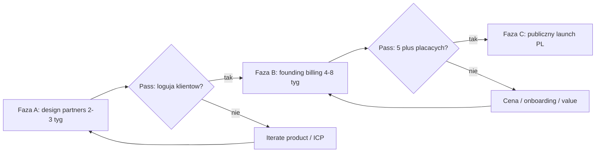
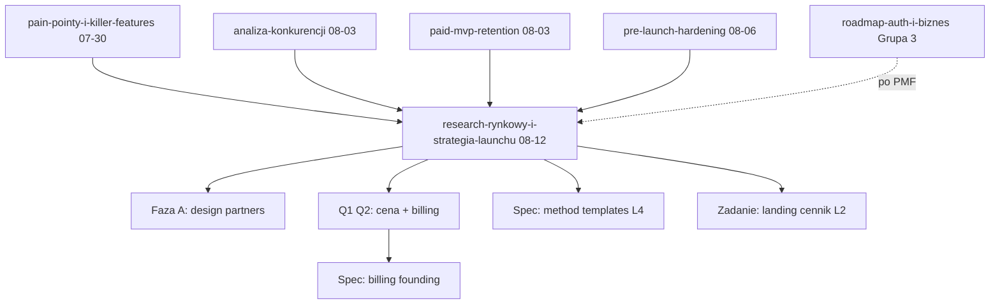

# Research rynkowy v2 + strategia launchu MVP

## TLDR

Aktualizacja researchu (sierpień 2026) + strategia wyjścia na rynek. Produkt technicznie jest gotowy na early access (auth, deploy, push, radar churnu, check-iny, swap, eksport, pre-launch hardening). **Brakuje strategii GTM i decyzji cenowych**, nie kolejnej fali ficzerów.

**Główne wnioski:**

1. **Trainerize (ABC) traci zaufanie** — błędy billingowe, pułapki anulowania, degradacja supportu, bugi logowania. Trust stack (uczciwa cena, eksport, anulowanie 1 klikiem) jest teraz argumentem sprzedażowym.
2. **Generation vs consolidation** — trenerzy nie chcą AI generującego więcej treści; wąskie gardło to przegląd tygodnia klienta. Dashboard uwagi + radar churnu = właściwa strona podziału → rdzeń pozycjonowania.
3. **Feature overwhelm = #1 powód powrotu do Excela**; ICP: solo trener PL z 8–25 podopiecznymi, dziś na Excelu/WhatsAppie (punkt przesiadki ~10–20 klientów).
4. **Cennik PL**: darmowe wejście (0 zł / 5 klientów) to standard rynkowy (CoachGuru, WodGuru). Flat 149 zł odstaje — rekomendacja: progi + founding price.
5. **Launch**: Faza A (5–10 design partnerów, white-glove) → Faza B (founding billing, 5+ płacących) → Faza C (publiczny launch PL + SEO „alternatywa dla…").

> Nie kodować z tego pliku poza P0 z [`2026-08-12-hormozi-oferta-i-gtm.md`](2026-08-12-hormozi-oferta-i-gtm.md). Q1–Q4 **zamknięte** (Hormozi, 12.08). Ujawniona preferencja, stos haków i money math: [`2026-08-12-hormozi-research-haki-i-skuszenie.md`](2026-08-12-hormozi-research-haki-i-skuszenie.md).

## Decyzje Q1–Q4 (zamknięte 2026-08-12)

- **Q1:** progi jak CoachGuru — Start 0 zł / 5, Solo 39 zł / 15, Pro 99 zł / 30, Studio 199 zł / 50. Nie per-klient.
- **Q2:** Stripe na founding (Checkout 490 zł). Autopay / BLIK gdy >20 płatnych self-serve. Patrz też [`2026-07-30-roadmap-auth-i-biznes.md`](2026-07-30-roadmap-auth-i-biznes.md).
- **Q3:** warm outreach jako jedyny kanał Fazy A (100 dni). Znajomi, grupy FB PT PL, siłownie, DM value-first. Nie ads. Playbook: `.ai/gtm/`.
- **Q4:** **RepMaxer** na zewnątrz. Workout Alchemist nie używać w outreachu.

Oferta Fazy A, gwarancja, founding: [`2026-08-12-hormozi-oferta-i-gtm.md`](2026-08-12-hormozi-oferta-i-gtm.md). Haki i ujawniona preferencja: [`2026-08-12-hormozi-research-haki-i-skuszenie.md`](2026-08-12-hormozi-research-haki-i-skuszenie.md).

---

## Część 1 — Research rynkowy v2 (sierpień 2026)

### Metodologia

Desk research aktualizujący [`2026-07-30-pain-pointy-i-killer-features.md`](2026-07-30-pain-pointy-i-killer-features.md) i [`2026-08-03-analiza-konkurencji-i-priorytety.md`](2026-08-03-analiza-konkurencji-i-priorytety.md). Źródła: recenzje Trainerize/TrueCoach/Everfit/PT Distinction 2026 (TrainerVerdict, CostBench, Trustpilot, G2/Capterra cytowane w agregatach), fora trenerskie (r/personaltraining — wątek „generation vs consolidation"), Hevy/Strong reviews, landingi i cenniki PL (CoachGuru, Fitebo, WodGuru, CoachPro, Trainomi), playbooki launchu B2B SaaS (paid pilots, concierge MVP).

Liczby branżowe traktujemy jako **kierunkowe** — przed skalowaniem walidujemy własnymi danymi z design partnerów.

### 1.1 Kryzys zaufania do Trainerize (ABC)

Po przejęciu przez ABC Fitness powtarzający się wzorzec w recenzjach 2026:

| Problem | Dowód / wzorzec | Impikacja dla nas |
|---|---|---|
| Błędy billingowe, obciążenia po anulowaniu | Trustpilot / CostBench: brak flow anulowania, chargebacks | Anulowanie 1 klikiem + przejrzysta faktura = trust |
| Degradacja supportu (canned answers) | Recenzje post-acquisition | White-glove na early access = przewaga |
| Bugi logowania sesji / dostarczania planów | „babysitting the platform" | Niezawodność loggera + autosave = non-negotiable |
| Sync MyFitnessPal „known issue" latami | Help center + reviews | Nie obiecywać integracji, których nie utrzymujemy |
| Data lock-in (eksport bez wiadomości/zdjęć; szablony nie migrują) | TrainerVerdict migration 4–6 min/klient | Eksport JSON/CSV już mamy — komunikować głośno |
| Add-ony (nutrition, video, white-label setki $/mies.) | Porównania kosztów przy 30 klientach | Prosta cena bez add-onów za coaching loop |

**Wniosek:** okno zaufania jest otwarte. Hasło nie „mamy więcej funkcji niż Trainerize", tylko „Twoje dane, Twoja cena, Twoja kontrola — bez niespodzianek na karcie".

### 1.2 Generation vs consolidation (najważniejszy sygnał forów)

Wąski, powtarzający się głos trenerów skalujących praktykę:

> AI workout builder to zła strona problemu. Generacja dodaje treść do przeczytania. Wąskie gardło to **konsolidacja tygodnia klienta** — nie spędzanie godzin na PC, żeby zrozumieć, kto wymaga uwagi.

Implikacje:

- Nasze **AI import planu** (pomoc przy cold start / migracji z Excela) = OK, bo skraca *wejście* danych, nie produkuje szumu operacyjnego.
- Nasz **dashboard uwagi + radar churnu + detektor zastoju** = właściwa strona podziału — to ma być #1 w pitchu.
- Unikać roadmapy „AI generuje treningi zamiast Ciebie" jako głównego marketingu — rynek to odrzuca jako bloat uzasadniający subskrypcję.

### 1.3 Feature overwhelm i powrót do Excela

| Obserwacja | Źródło | Impikacja |
|---|---|---|
| Trenerzy porzucają apki przez overwhelm + sztywność UI, wracają do Sheets | YouTube / blogi „Sheets vs apps"; Reddit | Minimalizm mono v2 = fosa, nie brak |
| Punkt przesiadki z arkuszy: ~10–20 klientów (czas admina ≈ czas coachingu) | FitImyze, AssistantCoach, MyPT Hub | ICP = solo PL 8–25 podopiecznych |
| Soft, który tworzy admin zamiast go usuwać, przegrywa z Excelem | Agregaty r/personaltraining | Każdy ficzer musi skracać czas trenera albo retencję klienta |

**ICP (Ideal Customer Profile) na Fazę A–B:**

- Solo trener personalny / hybrydowy (stacjonarnie + online), Polska.
- 8–25 aktywnych podopiecznych.
- Dziś: Excel/Sheets + WhatsApp + (opcjonalnie) CoachGuru / PDF.
- Boli: wolne przepisywanie planów, brak widoczności „kto trenował", klienci pytają „co dziś robię?", brak narracji progresu.
- **Nie** na start: duże studia multi-trener (WodGuru/eFitness), pure nutrition coaches, enterprise.

### 1.4 Czego trenerzy chcą najbardziej (agregat 2026)

Priorytet wg częstotliwości w recenzjach / forach / landingach PL:

| # | Potrzeba | Status u nas | Notatka |
|---|---|---|---|
| 1 | Szybkie programowanie + reusable frameworks / szablony | Częściowo (composer, AI import, szablony planów); **method templates** w backlogu | Podnieść priorytet — rynek prosi wprost |
| 2 | Widoczność wykonania + kto wymaga uwagi | **OK** — dashboard, churn radar, stagnation | Rdzeń pitchu |
| 3 | Komunikacja przypięta do programu (nie osobny czat-klon) | Częściowo — komentarze do sesji, notatki | Pełny czat = Fala 3 / po walidacji |
| 4 | Portal klienta bez tarcia (mobile, bez konta) | **OK** — magic-link + PWA | Chronić; komunikować |
| 5 | Przejrzysta cena, bez add-onów, klienci gratis | Do decyzji (Q1) | Trust stack |
| 6 | Eksport / anti lock-in | **OK** — JSON + CSV | Marketing |
| 7 | Mobile-first praca **trenera** (nie tylko klienta) | Responsive web — audyt jakości | Priorytet pod launch |
| 8 | Check-iny / habits między sesjami | **OK** — check-iny + pomiary | Nie rozbudowywać jak praca domowa |
| 9 | Wearables (HRV, sen) w widoku trenera | Brak | Post-MVP na radar; realny wpływ na deload u Trainerize |
| 10 | Nutrition native | Brak (anty-scope) | Najdroższy add-on konkurencji — świadomie nie |

### 1.5 Pain pointy klientów (potwierdzenie)

Bez zmian względem speca 30.07 — potwierdzone:

- **K1** Nie widzą postępu (okno 8–16 tyg.) → auto-raport / Peak-End.
- **A1** Friction logowania → logger Gravitus-path; nie psuć.
- **A4** Karząca gamifikacja → nadal anty-scope.
- Hevy/Strong: „ładny notes, nie trener" — potwierdza pozycjonowanie z trenerem w pętli. Ich friction (superserie, edycja mid-session, eksport za paywallem) = checklist jakości naszego loggera.

### 1.6 Cennik PL (benchmark sierpień 2026)

| Gracz | Model | Orientacja |
|---|---|---|
| **CoachGuru** | 0 zł / 5 klientów → 39 zł / 15 → 119 zł / 30 → 249 zł / 50 | Coaching + chat + kalendarz; klienci gratis |
| **WodGuru** | 0 zł / 10 → 5 zł/klient, cap 499 zł netto | Operacje studia (rezerwacje, pakiety) |
| **Fitebo** | Progi wg liczby podopiecznych (5/15/30/…) | Branding companion app |
| **CoachPro** | All-in-one + PDF + 24/7 habits | Marketing „mniej «co dziś robię?»" |
| **TrueCoach (EN)** | ~$20 / 5 → $53 / 20 → $107 / 50; 5% surcharge płatności | Prostota; bez Android client app |
| **Trainerize** | Tier + add-ony (nutrition, video, white-label) | Skala; ukryty TCO |

**Wniosek cenowy:** w PL darmowe wejście jest higieną. Flat 149 zł bez freemium odcina trenerów z 5–15 klientami (właśnie ICP). Rekomendacja w Części 2.

### 1.7 Gap analysis — aktualizacja vs stan produktu (sierpień 2026)

Legenda: **OK** wdrożone · **~** częściowo · **—** brak · **biz** roadmapa biznesowa

| Pain / potrzeba | Stan 30.07 | Stan dziś | Źródło wdrożenia |
|---|---|---|---|
| T1 Ceny / ukryte opłaty | Brak billing | Brak billing — decyzja Q1/Q2 | ten dok. |
| T2 Data lock-in | Brak eksportu | **OK** JSON + CSV (serie, pomiary, intake) | `paid-mvp-retention`, `pre-launch-hardening` |
| T3 Wolne programowanie | Composer, RIR | **~** + AI import; brak method templates | `ai-plan-import`; backlog `method-templates` |
| T5 Churn visibility | Zalążek „brak planu" | **OK** ChurnRadar + compliance + stagnation | `analiza-konkurencji` Fala 1 |
| T6 Skala / check-iny | Brak | **OK** check-iny + pomiary | `measurements-checkins-swap` |
| K1 Widoczny progres | Głównie trener | **~** trends, muscle volume, portal progres; Peak-End raporty w paid-mvp | `analiza-konkurencji`, portal redesign |
| K2 Komunikacja | Brak | **~** komentarze sesji, notatki, e-mail, push | `paid-mvp-retention`, `notatki-trenera-i-klienta` |
| K3 / A2 Swap w sesji | Brak | **OK** podmiana w loggerze | `measurements-checkins-swap` |
| A1 Logger friction | W toku | **OK** path Gravitus + hardening | `session-logger-hardening`, Styrka parity |
| A3 Utrata danych | Autosave | **OK** + PWA offline ikony | `pre-launch-hardening` |
| A5 Onboarding bez konta | Magic-link | **OK** chronić | portal PWA |
| Auth + deploy | Blokada | **OK** Clerk + Neon + produkcja | `mvp-auth-deploy-retencja` |
| Pre-launch hardening | — | **OK** | `pre-launch-hardening` |
| Kalendarz / pakiety / BLIK | — | **—** Grupa 3 | `roadmap-auth-i-biznes` |
| Nutrition / white-label / native coach app | — | Anty-scope | ten dok. |

### 1.8 Mocne karty (nie psuć przy launchu)

1. Portal **bez konta** + PWA per token.
2. Logger siłowy (POPRZ., rest, PR, swap, offline).
3. Programowanie keyboard-first + AI import z arkuszy/PDF.
4. Maxy / %1RM / trendy / objętość mięśniowa / zastój.
5. Dashboard z kolejką uwagi + radar churnu — **consolidation**, nie generation.
6. Eksport danych + minimum prawne (prywatność / regulamin / DELETE konta).
7. Estetyka mono v2 — kontrast vs „enterprise fitness CRM" PL.

---

## Część 2 — Strategia launchu MVP

### 2.1 Pozycjonowanie

**Jedno zdanie:** Aplikacja, dzięki której trener **reaguje pierwszy** — widzi, kto nie trenował, kto stoi w miejscu i co klient realnie zrobił — bez konta dla podopiecznego i bez ukrytych opłat.

**Nie jesteśmy:**

- Lepszy Hevy/Strong (B2C tracker).
- Kolejny all-in-one jak Mindbody / eFitness.
- AI, które „układa treningi za Ciebie".

**Jesteśmy:**

- Coaching loop: plan → log → progres → retencja.
- Antidotum na Excel + WhatsApp przy 10–25 klientach.
- Antidotum na Trainerize-style lock-in i add-ony.

**Trust stack (komunikować na landingu i w outreachu):**

1. Podopieczni zawsze bezpłatnie i **bez zakładania konta**.
2. Dane zawsze do eksportu (JSON/CSV) — „Twoje dane są Twoje".
3. Bez add-onów za podstawowy coaching loop.
4. Anulowanie subskrypcji 1 klikiem (gdy wejdzie billing) — zero chargeback theatre.
5. Support founderski na early access (Slack/WA/email z człowiekiem).

### 2.2 Cennik — rekomendacja (do decyzji Q1)

Zastępuje flat 149 zł z wcześniejszych założeń.

| Plan | Aktywni podopieczni | Cena / mies. | Rola |
|---|---|---|---|
| Start | do 5 | **0 zł** (na zawsze) | Freemium = standard PL; cold start bez ryzyka |
| Solo | do 15 | **39 zł** | Mirror CoachGuru Mini; ICP mid |
| Pro | do 30 | **99 zł** | Tańszy niż CoachGuru Growing (119) przy głębszym programowaniu siłowym |
| Studio | do 50 | **199 zł** | Przed custom; multi-trener później |

**Founding members (Faza A→B):** cena „locked forever" (−30–50% vs lista lub zamrożony Solo) dla pierwszych 10–20 trenerów w zamian za feedback i case study. Minimum 3 miesiące commitment przy płatnym pilocie.

**Komunikat:** „Płacisz tylko Ty. Podopieczni — zawsze 0 zł."

Alternatywa (Q1): model per-klient 5–8 zł jak WodGuru — prostszy messaging, gorzej porównuje się z CoachGuru na landingu „od 0 zł".

### 2.3 Fazy launchu

#### Faza A — Design partners (teraz, 2–3 tygodnie)

**Cel:** 5–10 trenerów aktywnie używa produktu z prawdziwymi klientami.

| Element | Szczegół |
|---|---|
| Oferta | Darmowy early access + white-glove onboarding (osobista sesja 30–45 min) |
| Commitment | Cotygodniowy feedback (15 min); candid bugs; opcjonalnie case study później |
| Kanały | Znajomi trenerzy, grupy FB PT PL, Instagram DM value-first, siłownie lokalne — **nie** płatne ads |
| Onboarding | Import 1 planu (AI) → 1 klient → link portalu → pierwsza sesja zalogowana w <10 min |
| Kill signal | <3 partnerów z ≥1 ukończoną sesją klienta po 14 dniach |
| Pass signal | ≥5 partnerów z aktywnością; jasne 2–3 powtarzające się requesty ficzerów |

**Manual playbook (concierge):** jeśli trener utknie na imporcie — zrób to z nim na callu. Walidujesz job-to-be-done zanim skalujesz self-serve.

#### Faza B — Founding pricing + billing (4–8 tygodni)

**Cel:** 5+ płacących trenerów; walidacja WTP (willingness to pay).

| Element | Szczegół |
|---|---|
| Oferta | Founding price locked forever; early access features; bezpośredni kanał do founderów |
| Wymaga | Decyzja Q1 (model) + Q2 (Stripe vs Autopay) + osobny spec billing |
| Onboarding | Self-serve + nadal ręczne dla founding |
| Kill signal | 0 konwersji z aktywnych partnerów A mimo jasnej wartości |
| Pass signal | ≥5 płatnych; churn <20% w miesiącu 2; NPS / „polecę koledze" ≥7/10 |

Grupa 3 (kalendarz / pakiety / płatności za sesje u klienta) **nie blokuje** Fazy B — to osobna ścieżka po walidacji rdzenia.

#### Faza C — Publiczny launch PL

**Cel:** powtarzalny acquisition bez 1:1 calli dla każdego.

| Kanał | Taktyka |
|---|---|
| SEO | Strony „alternatywa dla CoachGuru / Trainerize / TrueCoach" + porównania feature/cena |
| Community | Value-first posty w grupach branżowych (nie spam „nasza apka"); case studies z Fazy A/B |
| Referral | Trener→trener: miesiąc gratis / upgrade progu za polecenie |
| Content | „Jak wyjść z Excela w 10 minut" + demo AI import; „Radar churnu — dlaczego 20 dni ciszy boli" |
| Ads | Dopiero gdy CAC da się zmierzyć; nie na dzień 1 |

### 2.4 Metryki bramkowe

| Faza | Metryka | Cel |
|---|---|---|
| A | Design partnerzy z ≥1 klientem + ≥1 ukończoną sesją | ≥5 / 14 dni |
| A | Time-to-first-plan (od rejestracji) | < 10 min (mediana) |
| A | Time-to-first-client-session | < 7 dni |
| B | Płacący trenerzy | ≥5 |
| B | Miesięczny churn founding | < 20% |
| B | Aktywacja freemium→paid (gdy >5 klientów) | mierzyć, nie wymuszać |
| C | Organic signup / tydzień | trend ↑; CAC < 1 mies. ARPU |
| Zawsze | % klientów z sesją w ostatnich 14 dniach (per trener) | sygnał wartości produktu |
| Zawsze | Crash / utrata danych w sesji | ~0 (regresja = stop-ship) |

### 2.5 Anty-scope launchu (świadomie NIE)

| Anty-feature | Dlaczego |
|---|---|
| Nutrition / food diary | Najdroższy add-on konkurencji; inna domena |
| Native app trenera | Coach = web; klient = PWA wystarczy |
| White-label / osobny App Store | Capex i support; PL rynek kupuje wartość, nie logo za 200+ zł/mies. |
| Kalendarz + BLIK za sesje | Grupa 3 — po walidacji coaching loop |
| Karżące streaki / social feed | Retencja klientów spada; sprzeczne z research |
| AI „układa program zamiast Ciebie" jako hero | Generation vs consolidation — zły pitch |
| All-in-one studio (recepcja, czytniki) | To WodGuru — nie nasza wojna na start |
| Płatne ads przed organic proof | Spala budżet bez message-market fit |

---

## Część 3 — Priorytety produktowe pod launch

Kolejność wynikająca z researchu. **Nie** nowe pełne implementacje w tym dokumencie — każde większe → osobny spec.

| Priorytet | Temat | Dlaczego teraz | Następny krok |
|---|---|---|---|
| **L0** | Stabilność + trust (logger, offline, eksport, prawne) | Już wdrożone — nie regresować | Checklist przed każdym releasem; `./scripts/check.sh` |
| **L1** | Onboarding < 10 min do pierwszego planu | Pass/kill Fazy A; Goal Gradient | Audyt flow rejestracja → AI import / szablon → klient → link; copy + empty states |
| **L2** | Landing: cennik freemium + trust stack | Flat 149 odstaje od PL; Q1 | Po decyzji Q1 — update Pricing/FAQ (osobne zadanie copy) |
| **L3** | Jakość mobilnej pracy **trenera** | Reddit/recenzje: coach app desktop-first boli codziennie | Audyt responsive krytycznych ścieżek (dashboard, klient, szybka zmiana planu) — skill `responsive-ui` |
| **L4** | Szablony metod / reusable frameworks | T3 + #1 wishlist; było P3 → podnieść | Spec na bazie [`2026-07-05-method-templates.md`](2026-07-05-method-templates.md) |
| **L5** | Peak-End / auto-raport klienta (narracja 3 faktów) | K1 okno 8–16 tyg. | Dopiąć jeśli nie domknięte wizualnie w portalu |
| **L6** | Billing founding (Faza B) | WTP | Spec po Q1/Q2 |
| **L7** | SEO „alternatywa dla…" (Faza C) | Acquisition | Content + landing pages po case studies |
| Później | Wearables w coach view | Realny wpływ u Trainerize | Spike po PMF |
| Później | Grupa 3 kalendarz/pakiety | Rynek PL operacje | [`roadmap-auth-i-biznes`](2026-07-30-roadmap-auth-i-biznes.md) |
| Później | Pełny czat | Fragmentacja WhatsApp | Po walidacji komentarzy sesji |

### Relacja do innych speców

---

## Ryzyka

| Ryzyko | Mitigacja |
|---|---|
| Overbuild przed rozmowami z partnerami | Faza A = zero nowych dużych ficzerów poza L1 onboarding |
| Cena za wysoka vs CoachGuru | Freemium 5 + Solo 39 zł; founding lock |
| Cena za niska → brak sygnału WTP | Faza B wymaga płatności, nie wiecznego free dla power users |
| Partnerzy „chcą wszystko jak Fitebo" | Anty-scope + ICP filter; nie budować pod jednego głośnego |
| Flat messaging „AI" odstrasza consolidation camp | Pitch = radar + progres + zero konta |
| Billing PL bez BLIK obniża konwersję | Q2 świadomie; Stripe OK na founding jeśli komunikujemy kartę |
| Rozmycie z Grupą 3 (kalendarz) | Kalendarz nie leczy K1/A1; kolejność: coaching loop → cash ops |

---

## Changelog

| Data | Zmiana |
|---|---|
| 2026-08-12 | Pierwsza wersja: research v2 (Trainerize trust crisis, generation vs consolidation, Excel overwhelm, cennik PL), aktualizacja gap analysis, strategia launchu A–B–C, cennik freemium, metryki, anty-scope, priorytety L0–L7, Open Questions Q1–Q4. |
| 2026-08-12 | Q1–Q4 zamknięte (progi, Stripe, warm outreach, brand RepMaxer). Oferta: [`2026-08-12-hormozi-oferta-i-gtm.md`](2026-08-12-hormozi-oferta-i-gtm.md). |
